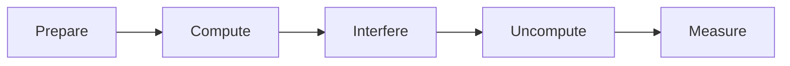

# Quantum Gates

## Single Qubit Gates

##### Pauli-X Gate

Equivalent to a classical NOT gate.

Flips:

0 → 1

1 → 0

---

---

##### Hadamard Gate

Creates superposition.

It prepares qubits for many quantum algorithms by allowing multiple computational paths to evolve simultaneously.

---

---

##### Pauli-Y Gate

Rotates a qubit around the Y-axis of the Bloch Sphere, introducing changes to both its state and phase.

---

---

##### Pauli-Z Gate

Changes the phase of a qubit without altering its measurement probabilities directly.

---

---

##### Phase Gates

Phase gates modify the phase of quantum states.

Although they may not change measurement probabilities immediately, they influence interference patterns that determine algorithm performance.

---

## Multi-Qubit Gates

##### CNOT Gate

The Controlled-NOT gate creates entanglement between two qubits.

It is one of the most important gates used in advanced quantum algorithms.

---

## Quantum Circuit Construction

### Quantum Circuits

Instead of writing programs as sequences of arithmetic instructions, quantum programs are represented as **quantum circuits**.

A quantum circuit consists of:

* Qubits
* Quantum gates
* Measurements

Each circuit represents a computational process.

The circuit begins by initializing qubits.

Quantum gates manipulate those qubits.

Finally, measurements convert quantum information into classical output.

Designing efficient quantum circuits is one of the primary skills developed in advanced quantum computing.

---

---

### Step 4: Building the Quantum Circuit

The quantum circuit is the heart of every quantum program.

Instead of writing instructions like traditional software, developers construct circuits by arranging quantum gates in a logical sequence.

A typical circuit consists of:

* Input qubits
* Initialization operations
* Quantum gates
* Controlled operations
* Measurement gates

Each gate modifies the quantum state according to the requirements of the selected algorithm.

Efficient circuit design is essential because every additional operation increases the possibility of hardware noise and computational errors.

---

## Measurement and State Evolution

### Quantum Measurement

Quantum information cannot be observed directly.

When a measurement occurs, the quantum state collapses into a classical result.

Because of this behavior, quantum programs are usually executed many times.

The repeated measurements produce probability distributions that help interpret computational results.

This probabilistic behavior is one of the defining characteristics of quantum computing.

---

---

### Step 5: Executing the Circuit

After the circuit has been designed, it is executed on either:

* A quantum simulator
* A real quantum processor

Simulators run on classical computers and are useful for learning, debugging, and testing algorithms.

Real quantum hardware performs calculations using physical qubits.

However, current quantum processors are affected by environmental noise, making repeated execution necessary to obtain statistically reliable results.

The HDQS platform allows learners to explore both simulated and hardware-oriented workflows, helping them understand the strengths and limitations of each approach.

---

---

### Step 6: Measurement

Quantum information cannot be observed directly.

At the end of a computation, the qubits are measured.

Measurement converts quantum information into classical binary values that can be interpreted by software.

Because quantum computation is probabilistic, a single execution does not provide complete information.

Instead, the circuit is executed many times.

These repeated executions produce a probability distribution showing how frequently different outcomes occur.

Developers analyze these distributions to determine the most likely solution.

---

## Circuit Optimization

### Step 7: Classical Processing

Quantum computers rarely operate independently.

After measurement, classical computers process the results.

This stage may include:

* Statistical analysis
* Data visualization
* Optimization
* Error mitigation
* Decision making
* Result verification

The classical processor determines whether the solution satisfies the original problem.

If improvements are needed, new parameters are generated and the quantum circuit is executed again.

---

---

### Step 8: Hybrid Optimization

One of the defining features of modern quantum computing is **hybrid quantum-classical computing**.

Instead of relying entirely on quantum hardware, hybrid systems divide work between classical and quantum processors.

A typical hybrid workflow follows these steps:

1. Classical software prepares the problem.
2. A quantum circuit is generated.
3. The quantum processor executes the circuit.
4. Measurements are collected.
5. Classical optimization algorithms evaluate the results.
6. Circuit parameters are updated.
7. The process repeats until a satisfactory solution is found.

Algorithms such as the **Variational Quantum Eigensolver (VQE)** and the **Quantum Approximate Optimization Algorithm (QAOA)** use this iterative approach and are among the most important techniques for today's noisy quantum hardware.

---

---

### Challenges During Execution

Although quantum computing is powerful, practical implementations face several challenges:

* Limited numbers of reliable qubits.
* Noise and decoherence affecting calculations.
* Quantum gate errors.
* Measurement uncertainty.
* Hardware scalability.
* Error correction overhead.

Researchers worldwide continue to develop improved hardware, algorithms, and error-correction techniques to address these challenges.

---

## Gate Design Principles

Quantum gates must be reversible. This is a major difference from many classical logic operations. A classical AND gate loses information because knowing the output does not uniquely identify the inputs. Quantum evolution is represented by unitary matrices, and unitary operations preserve information.

A matrix $U$ is unitary when:

$$
U^\dagger U = I
$$

This property means the operation can be reversed by applying $U^\dagger$. In circuit design, reversibility affects how learners construct arithmetic, oracles, and controlled operations. Temporary helper qubits may be used during computation, but they should often be uncomputed before measurement so that unnecessary entanglement does not affect the final result.

### Common Circuit Patterns

Several patterns appear repeatedly in quantum algorithms:

* **Prepare:** place qubits into a useful starting state.
* **Compute:** apply gates that encode the problem.
* **Interfere:** use gates such as Hadamard and phase rotations to shape amplitudes.
* **Uncompute:** reverse temporary calculations.
* **Measure:** convert quantum information into classical bits.



### HDQS Debugging Example

In HDQS, learners should inspect circuits before running large shot counts. A simple debugging workflow is:

```python
from hdqs import QuantumCircuit, Visualizer

circuit = QuantumCircuit(2, 2)
circuit.h(0)
circuit.cx(0, 1)
circuit.measure(0, 0)
circuit.measure(1, 1)

Visualizer.circuit(circuit)
```

When debugging a circuit, check:

* Are qubits initialized correctly?
* Are controls and targets in the intended order?
* Are measurements mapped to the correct classical bits?
* Are redundant gates increasing depth?
* Is the circuit using gates supported by the target backend?

### Basis Changes

Many quantum circuits measure in different bases by applying gates before measurement. For example, measuring in the X basis can be done by applying a Hadamard before computational-basis measurement.

```python
circuit.h(0)
circuit.measure(0, 0)
```

This pattern is important in quantum cryptography, tomography, and variational algorithms. Measurement is always performed by the device in a supported physical basis, but circuit operations can rotate the state so that the measurement reveals information about a different observable.

### Gate Equivalence and Simplification

Quantum circuits often contain gate sequences that can be simplified. For example, two X gates applied in sequence cancel:

$$
X X = I
$$

Similarly, two Hadamard gates cancel:

$$
H H = I
$$

Phase rotations can also combine:

$$
R_z(a)R_z(b)=R_z(a+b)
$$

In HDQS, learners should review generated circuits before execution. Removing redundant operations improves readability and reduces the chance of hardware error. This matters most when circuits are executed on noisy devices, where every additional gate introduces another opportunity for error.

```python
from hdqs import optimize_circuit

optimized = optimize_circuit(circuit, passes=["cancel_inverses", "merge_rotations"])
print(optimized.depth())
```

Optimization should not change the meaning of the circuit. After simplifying a circuit, learners should run both the original and optimized versions on a simulator and compare measurement distributions.

## Key Takeaways

* Quantum gates are matrix operations applied to qubits.
* Single-qubit gates rotate or transform one qubit state.
* Multi-qubit gates such as CNOT create correlations and entanglement.
* Quantum circuits are ordered sequences of gates followed by measurement.
* Circuit optimization reduces unnecessary depth and improves execution reliability.

## Summary

This module explained the core gate model used in quantum computing. Learners studied single-qubit gates, multi-qubit gates, circuit construction, measurement, state evolution, and optimization. These concepts provide the practical foundation for building algorithms in HDQS and for understanding how higher-level quantum workflows are executed.

## Knowledge Check

1. What does the X gate do to $|0\rangle$?
2. Why is the Hadamard gate important?
3. What is the purpose of a CNOT gate?
4. Why does measurement produce classical information?
5. What is circuit depth?
6. Why can shorter circuits be more reliable on noisy hardware?
7. How does HDQS help learners debug circuits?

## Practical Exercises

1. Build a one-qubit circuit using X, H, and Z gates.
2. Create a two-qubit circuit with a CNOT gate and measure both qubits.
3. Compare measurement counts before and after adding a Hadamard gate.
4. Draw a circuit diagram for Bell-state preparation.
5. Identify and remove redundant gates from a simple circuit.

## References

* IBM Quantum Documentation: Quantum Gates
* Qiskit Textbook: Single-Qubit Gates and Multi-Qubit Gates
* Michael A. Nielsen and Isaac L. Chuang, *Quantum Computation and Quantum Information*
