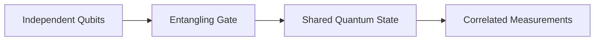

# Entanglement

Entanglement is one of the defining features of quantum computing. When qubits are entangled, the state of the full system cannot be described by treating each qubit independently. The information belongs to the combined system.

This module explains Bell states, entanglement, density matrices, mixed states, and Bloch sphere analysis. These concepts are essential for quantum algorithms, teleportation, quantum communication, error correction, and quantum machine learning.

## Bell States

Bell states are maximally entangled two-qubit states. The most common Bell state is:

$$
|\Phi^+\rangle=\frac{|00\rangle+|11\rangle}{\sqrt{2}}
$$

This state does not mean the first qubit is secretly 0 or 1 before measurement. Instead, the pair exists as a shared quantum state. If both qubits are measured in the computational basis, the outcomes are correlated: both are 0 or both are 1.

The four Bell states are:

$$
|\Phi^+\rangle=\frac{|00\rangle+|11\rangle}{\sqrt{2}}
$$

$$
|\Phi^-\rangle=\frac{|00\rangle-|11\rangle}{\sqrt{2}}
$$

$$
|\Psi^+\rangle=\frac{|01\rangle+|10\rangle}{\sqrt{2}}
$$

$$
|\Psi^-\rangle=\frac{|01\rangle-|10\rangle}{\sqrt{2}}
$$

### HDQS Example

```python
from hdqs import QuantumCircuit, Simulator

circuit = QuantumCircuit(2, 2)
circuit.h(0)
circuit.cx(0, 1)
circuit.measure(0, 0)
circuit.measure(1, 1)

counts = Simulator(shots=1024).run(circuit).counts()
print(counts)
```

Expected results are dominated by `00` and `11`. On real hardware, small counts for `01` and `10` can appear because of noise.

## Quantum Entanglement

Entanglement occurs when the state of multiple qubits must be described as one combined state. For separable states, the system can be written as:

$$
|\psi\rangle = |\psi_A\rangle \otimes |\psi_B\rangle
$$

For entangled states, this factorization is not possible.

Entanglement is useful because it creates correlations that quantum algorithms can manipulate. It is central to:

* Bell-state experiments.
* Quantum teleportation.
* Quantum key distribution.
* Quantum error correction.
* Multi-qubit algorithms.



Entanglement must be handled carefully. It is powerful, but it is also fragile. Noise, uncontrolled measurement, and interaction with the environment can reduce coherence.

## Density Matrices

State vectors are useful for pure states. A pure state has complete quantum information and can be written as $|\psi\rangle$. A density matrix provides a more general representation:

$$
\rho = |\psi\rangle\langle\psi|
$$

For the state:

$$
|\psi\rangle=\alpha|0\rangle+\beta|1\rangle
$$

the density matrix is:

$$
\rho =
\begin{bmatrix}
|\alpha|^2 & \alpha\beta^* \\
\alpha^*\beta & |\beta|^2
\end{bmatrix}
$$

The diagonal elements represent measurement probabilities. The off-diagonal elements represent coherence.

Density matrices are important because they can describe both pure and mixed states. They are also used to analyze noise, decoherence, and partial information about a subsystem.

### HDQS Example

```python
from hdqs import QuantumCircuit, StateAnalyzer

circuit = QuantumCircuit(1)
circuit.h(0)

rho = StateAnalyzer(circuit).density_matrix()
print(rho)
```

For the $|+\rangle$ state, the density matrix contains nonzero off-diagonal values, showing coherence between $|0\rangle$ and $|1\rangle$.

## Mixed States

A mixed state represents uncertainty about which pure state a system is in. It is written as:

$$
\rho=\sum_i p_i |\psi_i\rangle\langle\psi_i|
$$

where $p_i$ are probabilities and:

$$
\sum_i p_i=1
$$

For example, a system that is 50 percent $|0\rangle$ and 50 percent $|1\rangle$ has:

$$
\rho=
\frac{1}{2}|0\rangle\langle0|+
\frac{1}{2}|1\rangle\langle1|
=
\begin{bmatrix}
0.5 & 0 \\
0 & 0.5
\end{bmatrix}
$$

This is different from the pure state:

$$
|+\rangle=\frac{|0\rangle+|1\rangle}{\sqrt{2}}
$$

Both produce 50 percent 0 and 50 percent 1 in the computational basis, but $|+\rangle$ has coherence and the mixed state does not.

Mixed states are used to describe:

* Noisy qubits.
* Partial measurement.
* Environmental interaction.
* Subsystems of entangled states.

## Bloch Sphere Analysis

The Bloch sphere is a geometric representation of a single qubit state:

$$
|\psi\rangle=\cos(\theta/2)|0\rangle+e^{i\phi}\sin(\theta/2)|1\rangle
$$

The angles $\theta$ and $\phi$ locate the state on the sphere.

Important points include:

* North pole: $|0\rangle$
* South pole: $|1\rangle$
* Positive x-axis: $|+\rangle$
* Negative x-axis: $|-\rangle$

Single-qubit gates rotate the state around the sphere. For example:

* X gate rotates around the x-axis.
* Y gate rotates around the y-axis.
* Z gate rotates around the z-axis.
* Hadamard moves between computational and diagonal basis states.

### HDQS Example

```python
from hdqs import QuantumCircuit, Visualizer

circuit = QuantumCircuit(1)
circuit.h(0)
circuit.rz(0.7, 0)

Visualizer.bloch_sphere(circuit, qubit=0)
```

Bloch sphere analysis is useful for building intuition, but it applies directly only to single qubits. Multi-qubit states require higher-dimensional descriptions.

## Entanglement in Algorithms and Communication

Entanglement is not only a strange physical effect. It is a practical resource. In algorithms, entanglement allows multi-qubit registers to represent relationships between variables. In communication, it enables protocols such as teleportation and entanglement-based key distribution.

For example, the Bell state:

$$
|\Phi^+\rangle=\frac{|00\rangle+|11\rangle}{\sqrt{2}}
$$

has perfect computational-basis correlation. If Alice measures the first qubit and gets 0, Bob will measure 0. If Alice gets 1, Bob will measure 1. However, before measurement the state is not simply a hidden classical pair. Measurements in other bases reveal correlations that are genuinely quantum.

### Reduced States

When a subsystem of an entangled state is examined alone, it can appear mixed. For the Bell state, the full two-qubit system is pure, but either individual qubit has reduced density matrix:

$$
\rho_A =
\begin{bmatrix}
0.5 & 0 \\
0 & 0.5
\end{bmatrix}
$$

This means the individual qubit looks maximally random, even though the combined system is highly structured. This idea is important in quantum information because local randomness can coexist with global order.

### Entanglement Verification

In introductory HDQS labs, learners often verify entanglement through measurement counts. A stronger analysis measures in multiple bases. For a Bell pair, correlations can be checked after basis rotations:

```python
from hdqs import QuantumCircuit, Simulator

def bell_x_basis():
    circuit = QuantumCircuit(2, 2)
    circuit.h(0)
    circuit.cx(0, 1)
    circuit.h(0)
    circuit.h(1)
    circuit.measure(0, 0)
    circuit.measure(1, 1)
    return circuit

counts = Simulator(shots=1024).run(bell_x_basis()).counts()
print(counts)
```

If correlations persist across appropriate bases, the evidence for entanglement is stronger than a single computational-basis measurement.

### Decoherence and Loss of Entanglement

Entanglement is fragile. Interaction with the environment can turn a coherent entangled state into a less useful mixed state. This process is called decoherence. In real hardware, decoherence limits circuit depth and affects algorithms that depend on multi-qubit correlations.

Practical strategies include:

* Keep circuits shallow.
* Use native gates where possible.
* Reduce unnecessary entanglement.
* Apply error mitigation.
* Choose hardware topology carefully.

HDQS simulations help learners compare ideal and noisy circuits so they can see how entanglement quality changes under realistic conditions.

## Practical Entanglement Metrics

As circuits become larger, visual inspection is not enough. Learners need numerical ways to discuss entanglement and mixedness. One useful quantity is purity:

$$
\text{Tr}(\rho^2)
$$

For a pure state, purity equals 1. For a mixed state, purity is less than 1. This helps distinguish coherent quantum states from states that have lost information to noise or measurement.

Another important concept is fidelity. Fidelity compares how close a prepared state is to a target state. In a Bell-state lab, the target may be $|\Phi^+\rangle$. A high-fidelity preparation means the generated state closely matches the intended Bell state.

```python
from hdqs import QuantumCircuit, StateAnalyzer

circuit = QuantumCircuit(2)
circuit.h(0)
circuit.cx(0, 1)

analyzer = StateAnalyzer(circuit)
print(analyzer.purity())
print(analyzer.fidelity_with_bell_state("phi_plus"))
```

These metrics help learners move from qualitative descriptions to engineering analysis. In real quantum software work, measurement counts, fidelity, purity, and noise estimates are all part of evaluating whether a circuit is useful.

## Key Takeaways

* Bell states are maximally entangled two-qubit states.
* Entangled systems cannot be described as independent qubits.
* Density matrices describe pure states, mixed states, and noisy systems.
* Mixed states represent classical uncertainty or reduced quantum information.
* The Bloch sphere visualizes single-qubit states and gate rotations.

## Summary

This module developed the core tools needed to understand multi-qubit quantum systems. Bell states demonstrate entanglement, density matrices generalize state vectors, mixed states explain noisy or incomplete information, and the Bloch sphere provides single-qubit geometric intuition. These ideas support later work in teleportation, cryptography, variational algorithms, and quantum machine learning.

## Knowledge Check

1. What makes a Bell state entangled?
2. Why can an entangled state not be written as a product of independent qubit states?
3. What do the diagonal entries of a density matrix represent?
4. What do off-diagonal entries represent?
5. How is a mixed state different from a pure superposition?
6. Which Bloch sphere point represents $|0\rangle$?
7. Why is the Bloch sphere limited to single-qubit visualization?

## Practical Exercises

1. Generate all four Bell states in HDQS.
2. Compare measurement counts for Bell states on an ideal simulator and noisy simulator.
3. Compute the density matrix for $|0\rangle$, $|1\rangle$, and $|+\rangle$.
4. Explain why a 50/50 mixed state differs from $|+\rangle$.
5. Visualize rotations produced by X, Y, Z, and H gates on the Bloch sphere.

## References

* Michael A. Nielsen and Isaac L. Chuang, *Quantum Computation and Quantum Information*
* IBM Quantum Documentation: Multiple Qubits and Entanglement
* Qiskit Textbook: The Bloch Sphere and Multi-Qubit States
