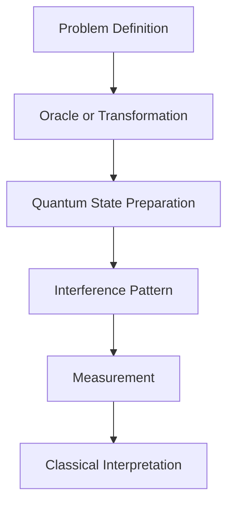
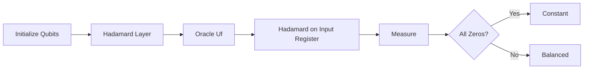
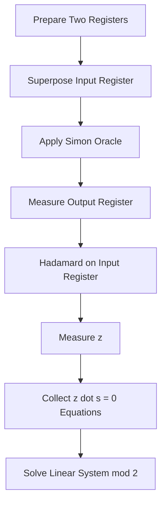
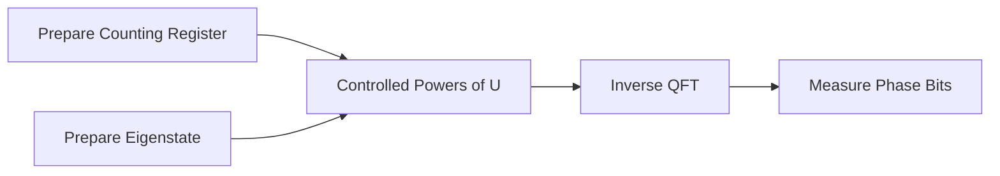

# Quantum Algorithms

Quantum algorithms are procedures that use superposition, interference, entanglement, and measurement to solve selected computational problems in a different way from classical algorithms. A quantum algorithm is not powerful because it "tries every answer at once." It is powerful when the circuit is designed so that wrong paths cancel through destructive interference and useful paths become more likely through constructive interference.

In HDQS, learners study algorithms by building small circuits, simulating probability distributions, and comparing quantum results with classical approaches. The goal is to understand the structure of the algorithm, not only to run code.



## Deutsch Algorithm

The Deutsch algorithm is the simplest example of quantum speedup. It studies a function:

$$
f:\{0,1\}\rightarrow\{0,1\}
$$

The function can be either **constant** or **balanced**.

* Constant means both inputs produce the same output.
* Balanced means the two inputs produce different outputs.

Classically, the worst case requires checking both inputs. Quantumly, the Deutsch algorithm can determine the type of function with one oracle query.

The circuit uses two qubits. The first qubit stores the input. The second qubit helps reveal phase information. The important idea is **phase kickback**. Instead of reading the function output directly, the algorithm converts function information into a phase change that can interfere.

Initial state:

$$
|0\rangle|1\rangle
$$

After applying Hadamard gates:

$$
\frac{|0\rangle + |1\rangle}{\sqrt{2}} \otimes \frac{|0\rangle - |1\rangle}{\sqrt{2}}
$$

The oracle applies:

$$
U_f|x,y\rangle = |x, y \oplus f(x)\rangle
$$

Because the second qubit is prepared in the state $(|0\rangle - |1\rangle)/\sqrt{2}$, the oracle produces a phase:

$$
(-1)^{f(x)}|x\rangle
$$

If the function is constant, both branches receive the same phase and the first qubit measures as 0. If the function is balanced, the branches receive opposite phases and the first qubit measures as 1.

### HDQS Example

```python
from hdqs import QuantumCircuit, Simulator

def deutsch_constant_zero():
    circuit = QuantumCircuit(2, 1)
    circuit.x(1)
    circuit.h(0)
    circuit.h(1)
    # Oracle for f(x) = 0 does nothing.
    circuit.h(0)
    circuit.measure(0, 0)
    return circuit

def deutsch_balanced_identity():
    circuit = QuantumCircuit(2, 1)
    circuit.x(1)
    circuit.h(0)
    circuit.h(1)
    circuit.cx(0, 1)
    circuit.h(0)
    circuit.measure(0, 0)
    return circuit

simulator = Simulator(shots=1024)
print(simulator.run(deutsch_constant_zero()).counts())
print(simulator.run(deutsch_balanced_identity()).counts())
```

Expected result:

* Constant oracle: mostly `0`
* Balanced oracle: mostly `1`

The Deutsch algorithm is small, but it introduces the pattern used by larger algorithms: prepare a superposition, query an oracle, create interference, and measure the result.

## Deutsch-Jozsa Algorithm

The Deutsch-Jozsa algorithm generalizes the Deutsch algorithm from one input bit to many input bits. It studies a function:

$$
f:\{0,1\}^n\rightarrow\{0,1\}
$$

The promise is that the function is either constant or balanced.

Classically, in the worst case, more than half the possible inputs may need to be checked before the function can be classified. For $n$ input bits, there are $2^n$ possible inputs. The worst-case classical query count is:

$$
2^{n-1}+1
$$

The Deutsch-Jozsa algorithm solves the promised problem with one quantum oracle query.

The algorithm works as follows:

1. Prepare $n$ input qubits in $|0\rangle$ and one output qubit in $|1\rangle$.
2. Apply Hadamard gates to all qubits.
3. Apply the oracle $U_f$.
4. Apply Hadamard gates to the input qubits.
5. Measure the input register.

If all input qubits measure as 0, the function is constant. If any measured bit is 1, the function is balanced.



### Mathematical View

After the first Hadamard layer, the input register is:

$$
\frac{1}{\sqrt{2^n}}\sum_x |x\rangle
$$

The oracle creates a phase:

$$
\frac{1}{\sqrt{2^n}}\sum_x (-1)^{f(x)}|x\rangle
$$

The final Hadamard transform converts this phase pattern into measurable amplitudes. For a constant function, the phases align and produce $|00...0\rangle$. For a balanced function, the positive and negative phases cancel for the all-zero state.

### HDQS Example

```python
from hdqs import QuantumCircuit, Simulator

def deutsch_jozsa_balanced(n):
    circuit = QuantumCircuit(n + 1, n)
    output = n

    circuit.x(output)
    for q in range(n + 1):
        circuit.h(q)

    # Balanced oracle: f(x) = x0 xor x1 xor ...
    for q in range(n):
        circuit.cx(q, output)

    for q in range(n):
        circuit.h(q)
        circuit.measure(q, q)

    return circuit

simulator = Simulator(shots=1024)
result = simulator.run(deutsch_jozsa_balanced(3))
print(result.counts())
```

In practice, this algorithm teaches how oracle design controls quantum behavior. The speedup is clear under the promise, but the value for learners is deeper: it shows how a global property of a function can be extracted without evaluating every input separately.

## Bernstein-Vazirani Algorithm

The Bernstein-Vazirani algorithm finds a hidden bit string $s$ inside a function:

$$
f(x)=s\cdot x \pmod 2
$$

Here, $x$ is an $n$-bit input and $s$ is an unknown $n$-bit string. The dot product is computed modulo 2:

$$
s\cdot x=s_1x_1\oplus s_2x_2\oplus ... \oplus s_nx_n
$$

Classically, finding $s$ requires querying the function with each basis input. For example, to discover the first bit of $s$, a classical algorithm queries $100...0$. To discover the second bit, it queries $010...0$. This requires $n$ queries.

The quantum algorithm finds the full string with one oracle query.

The circuit resembles Deutsch-Jozsa:

1. Prepare input qubits in $|0\rangle$.
2. Prepare the output qubit in $|1\rangle$.
3. Apply Hadamard gates.
4. Apply the oracle.
5. Apply Hadamard gates to the input register.
6. Measure the input register.

The final measurement returns the hidden string $s$.

### Why It Works

The oracle applies a phase:

$$
(-1)^{s\cdot x}
$$

This phase pattern is exactly the Fourier signature of the hidden string. The final Hadamard transform converts that signature into the computational basis state:

$$
|s\rangle
$$

### HDQS Example

```python
from hdqs import QuantumCircuit, Simulator

def bernstein_vazirani(secret):
    n = len(secret)
    circuit = QuantumCircuit(n + 1, n)
    output = n

    circuit.x(output)
    for q in range(n + 1):
        circuit.h(q)

    for index, bit in enumerate(secret):
        if bit == "1":
            circuit.cx(index, output)

    for q in range(n):
        circuit.h(q)
        circuit.measure(q, q)

    return circuit

secret = "1011"
simulator = Simulator(shots=1024)
print(simulator.run(bernstein_vazirani(secret)).counts())
```

Expected output is dominated by `1011`, depending on bit ordering conventions in the simulator. In HDQS, learners should inspect the circuit diagram and confirm whether the platform displays classical bits in left-to-right or right-to-left order.

The Bernstein-Vazirani algorithm is important because it makes quantum information extraction visible. Instead of learning one bit at a time, the algorithm encodes the full hidden string into phase and recovers it through interference.

## Simon's Algorithm

Simon's algorithm is historically important because it introduced ideas that later influenced Shor's algorithm. It solves a hidden-period problem.

The algorithm is given a function:

$$
f:\{0,1\}^n\rightarrow\{0,1\}^n
$$

The promise is:

$$
f(x)=f(y) \text{ if and only if } y=x\oplus s
$$

The hidden string $s$ is unknown. The goal is to find $s$.

Classically, discovering $s$ can require exponentially many queries in the worst case. Simon's quantum algorithm uses repeated circuit executions to collect equations that reveal $s$.

### Algorithm Structure

1. Prepare two $n$-qubit registers.
2. Apply Hadamard gates to the first register.
3. Query the oracle.
4. Measure the second register.
5. Apply Hadamard gates to the first register.
6. Measure the first register.
7. Repeat to collect equations.
8. Solve the linear system over modulo 2 arithmetic.

Each measurement gives a bit string $z$ satisfying:

$$
z\cdot s=0 \pmod 2
$$

After collecting enough independent equations, classical post-processing solves for $s$.



### Practical Interpretation

Simon's algorithm is not usually implemented as a beginner production application. Its value is conceptual. It shows that quantum circuits can reveal hidden algebraic structure using probability distributions that are hard to reproduce classically.

This structure appears again in period finding, Fourier sampling, and Shor's factoring algorithm. For this reason, Simon's algorithm is a bridge between early oracle algorithms and advanced quantum algorithms.

### HDQS Simulation Pattern

```python
from hdqs import QuantumCircuit, Simulator
from hdqs.postprocess import solve_mod2

def simon_trial(oracle, n):
    circuit = QuantumCircuit(2 * n, n)

    for q in range(n):
        circuit.h(q)

    oracle(circuit)

    for q in range(n):
        circuit.h(q)
        circuit.measure(q, q)

    return circuit

equations = []
simulator = Simulator(shots=1)

for _ in range(12):
    circuit = simon_trial(hidden_oracle, n=4)
    bitstring = simulator.run(circuit).most_likely()
    equations.append(bitstring)

secret = solve_mod2(equations)
print(secret)
```

This example uses `hidden_oracle` as a placeholder for a supplied Simon oracle. In a classroom or HDQS lab, the instructor can provide the oracle while learners focus on the measurement equations and classical post-processing.

## Quantum Fourier Transform

The Quantum Fourier Transform (QFT) is the quantum version of the discrete Fourier transform. It maps computational basis states into phase-encoded frequency states.

For $N=2^n$, the QFT transforms a basis state $|x\rangle$ as:

$$
|x\rangle \rightarrow \frac{1}{\sqrt{N}}\sum_{y=0}^{N-1}e^{2\pi ixy/N}|y\rangle
$$

The QFT is central to many advanced algorithms, including phase estimation and Shor's algorithm. It is efficient because the quantum circuit can implement the transform using Hadamard gates and controlled phase rotations.

### Circuit Components

For each qubit, the QFT applies:

* A Hadamard gate.
* Controlled phase rotations.
* Optional swap gates to reverse qubit order.

The controlled phase rotation is:

$$
R_k =
\begin{bmatrix}
1 & 0 \\
0 & e^{2\pi i/2^k}
\end{bmatrix}
$$

### HDQS Example

```python
from hdqs import QuantumCircuit

def qft(circuit, qubits):
    n = len(qubits)
    for i in range(n):
        target = qubits[i]
        circuit.h(target)
        for j in range(i + 1, n):
            control = qubits[j]
            angle = 3.141592653589793 / (2 ** (j - i))
            circuit.cp(angle, control, target)

    for i in range(n // 2):
        circuit.swap(qubits[i], qubits[n - i - 1])
```

The QFT is not normally measured directly as a final answer. Instead, it is used inside larger algorithms to reveal periodicity or phase information.

## Phase Estimation

Quantum Phase Estimation estimates the eigenvalue phase of a unitary operator. If:

$$
U|\psi\rangle=e^{2\pi i\theta}|\psi\rangle
$$

then phase estimation estimates $\theta$.

The algorithm uses two registers:

* A counting register that stores phase information.
* A target register prepared in an eigenstate of $U$.

The circuit applies controlled powers of $U$:

$$
U^{2^0}, U^{2^1}, U^{2^2}, ...
$$

Then it applies the inverse QFT to the counting register. The measured bit string approximates the phase.



### HDQS Example

```python
from hdqs import QuantumCircuit, Simulator

def phase_estimation(theta, precision_qubits=3):
    circuit = QuantumCircuit(precision_qubits + 1, precision_qubits)
    target = precision_qubits

    circuit.x(target)

    for q in range(precision_qubits):
        circuit.h(q)

    for q in range(precision_qubits):
        repetitions = 2 ** q
        for _ in range(repetitions):
            circuit.cp(2 * 3.141592653589793 * theta, q, target)

    circuit.inverse_qft(range(precision_qubits))

    for q in range(precision_qubits):
        circuit.measure(q, q)

    return circuit

simulator = Simulator(shots=2048)
print(simulator.run(phase_estimation(theta=0.625)).counts())
```

Phase estimation is one of the most important algorithmic building blocks in quantum computing. It appears in quantum chemistry, order finding, amplitude estimation, and Shor's algorithm.

## Grover's Search

Grover's search algorithm finds a marked item in an unstructured search space. If there are $N$ possible items, a classical search may require $O(N)$ checks. Grover's algorithm finds the item in approximately:

$$
O(\sqrt{N})
$$

The speedup is quadratic rather than exponential, but it is still important for search, optimization, and amplitude amplification.

Grover's algorithm contains two main components:

* An **oracle** that marks the correct answer by flipping its phase.
* A **diffusion operator** that amplifies the marked state's amplitude.

The state begins as a uniform superposition:

$$
|\psi\rangle=\frac{1}{\sqrt{N}}\sum_x |x\rangle
$$

The oracle changes the sign of the target state:

$$
|w\rangle \rightarrow -|w\rangle
$$

The diffusion operator reflects amplitudes around their average, increasing the target probability.

### Number of Iterations

For one marked item, the approximate number of Grover iterations is:

$$
\left\lfloor \frac{\pi}{4}\sqrt{N} \right\rfloor
$$

Too few iterations do not amplify enough. Too many iterations can rotate the state past the target and reduce success probability.

### HDQS Example

```python
from hdqs import QuantumCircuit, Simulator

def grover_two_qubit(target="11"):
    circuit = QuantumCircuit(2, 2)

    circuit.h(0)
    circuit.h(1)

    # Oracle for target 11.
    circuit.cz(0, 1)

    # Diffusion operator.
    circuit.h(0)
    circuit.h(1)
    circuit.x(0)
    circuit.x(1)
    circuit.cz(0, 1)
    circuit.x(0)
    circuit.x(1)
    circuit.h(0)
    circuit.h(1)

    circuit.measure(0, 0)
    circuit.measure(1, 1)
    return circuit

simulator = Simulator(shots=1024)
print(simulator.run(grover_two_qubit()).counts())
```

The expected distribution is dominated by the marked state. In HDQS labs, learners should compare the result before and after the diffusion operator to see amplitude amplification directly.

## Amplitude Amplification

Amplitude amplification generalizes Grover's search. Instead of only finding one marked item, it increases the probability of measuring desired outcomes produced by a quantum subroutine.

Suppose a quantum procedure prepares:

$$
A|0\rangle=\sqrt{p}|good\rangle+\sqrt{1-p}|bad\rangle
$$

Amplitude amplification increases the probability $p$ of the good state using repeated reflections.

Grover's algorithm is a special case where:

* $A$ prepares a uniform superposition.
* The good state is the marked item.
* Repeated reflections amplify the marked amplitude.

Amplitude amplification is useful in:

* Search problems
* Optimization
* Monte Carlo estimation
* Quantum machine learning subroutines
* State preparation workflows

### Practical HDQS Pattern

```python
from hdqs import QuantumCircuit

def amplitude_amplification(circuit, prepare, mark_good, reflect_zero, rounds):
    prepare(circuit)
    for _ in range(rounds):
        mark_good(circuit)
        prepare(circuit, inverse=True)
        reflect_zero(circuit)
        prepare(circuit)
    return circuit
```

This template separates the algorithm into reusable parts. In advanced labs, students can replace `prepare`, `mark_good`, and `reflect_zero` to build different amplification workflows.

## Shor's Algorithm

Shor's algorithm factors large integers using quantum period finding. It is one of the most famous quantum algorithms because it can theoretically break widely used public-key cryptosystems such as RSA when implemented on sufficiently large fault-tolerant quantum computers.

The factoring problem begins with an integer $N$. The algorithm chooses a random integer $a$ such that:

$$
1<a<N
$$

and computes the period $r$ of:

$$
f(x)=a^x \mod N
$$

The period satisfies:

$$
a^r \equiv 1 \pmod N
$$

If $r$ is even and $a^{r/2}\not\equiv -1 \pmod N$, then factors of $N$ can be found using:

$$
\gcd(a^{r/2}-1,N)
$$

and:

$$
\gcd(a^{r/2}+1,N)
$$

### Quantum Role

The quantum computer performs period finding using superposition, modular exponentiation, and the inverse QFT. The classical computer performs number-theoretic pre-processing and post-processing.

```mermaid
flowchart TD
    A[Choose N and Random a]
    B[Check gcd(a, N)]
    C[Quantum Period Finding]
    D[Inverse QFT Measurement]
    E[Classical Continued Fractions]
    F[Compute gcd Values]
    G[Return Factors]

    A --> B --> C --> D --> E --> F --> G
```

Shor's algorithm is beyond near-term hardware for large useful numbers, but it is essential for understanding why quantum computing matters to cryptography.

## Key Takeaways

* Quantum algorithms use interference to make useful measurement outcomes more likely.
* Deutsch, Deutsch-Jozsa, and Bernstein-Vazirani demonstrate oracle-based speedups.
* Simon's algorithm reveals hidden structure and introduces ideas used in period finding.
* QFT and phase estimation are central building blocks for advanced algorithms.
* Grover's algorithm provides quadratic speedup for unstructured search.
* Shor's algorithm uses quantum period finding to factor integers.

## Summary

This module introduced the major algorithmic patterns used in quantum computing. Early oracle algorithms show how phase kickback and interference reveal global information. Simon's algorithm and QFT-based phase estimation show how quantum circuits can extract hidden algebraic structure. Grover's algorithm and amplitude amplification demonstrate probability enhancement. Shor's algorithm connects these ideas to one of the most important applications of quantum computing: integer factorization.

## Knowledge Check

1. What is the difference between a constant function and a balanced function?
2. Why does the Deutsch algorithm require an output qubit initialized to $|1\rangle$?
3. What role does phase kickback play in oracle algorithms?
4. How many oracle queries does Bernstein-Vazirani require on a quantum computer?
5. What type of equations does Simon's algorithm collect?
6. Why is the Quantum Fourier Transform important for phase estimation?
7. What is the approximate query complexity of Grover's search?
8. Why can too many Grover iterations reduce success probability?
9. How does Shor's algorithm use period finding?
10. Which parts of Shor's algorithm are classical?

## Practical Exercises

1. Implement the Deutsch algorithm for all four one-bit Boolean functions.
2. Build a three-qubit Deutsch-Jozsa circuit with a balanced oracle.
3. Implement Bernstein-Vazirani for the hidden strings `101`, `011`, and `111`.
4. Simulate Grover's algorithm for a two-qubit search space and compare results before and after diffusion.
5. Build a QFT circuit for three qubits and inspect the circuit depth.
6. Run phase estimation for phases 0.25, 0.5, and 0.75.
7. Explain why Simon's algorithm needs classical post-processing.
8. Write a short report comparing Grover's speedup with Shor's speedup.

## References

* Michael A. Nielsen and Isaac L. Chuang, *Quantum Computation and Quantum Information*
* IBM Quantum Documentation: Quantum Algorithms
* Qiskit Textbook: Deutsch-Jozsa, Bernstein-Vazirani, Grover, QFT
* Peter Shor, "Algorithms for quantum computation: discrete logarithms and factoring"
* Daniel Simon, "On the power of quantum computation"
