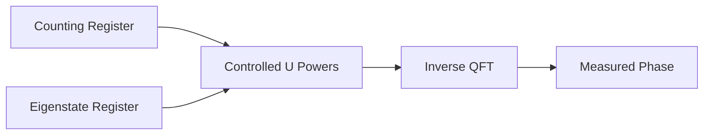
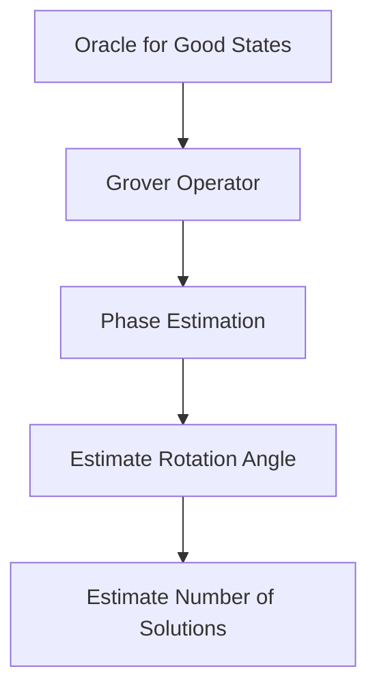

# Search

This module focuses on quantum search and Fourier-based subroutines. Search in quantum computing is not only about finding a word in a list. It includes amplitude amplification, phase estimation, and transformations that reveal hidden structure.

## Quantum Fourier Transform

The Quantum Fourier Transform (QFT) maps computational basis states into phase-encoded frequency states:

$$
|x\rangle \rightarrow \frac{1}{\sqrt{N}}\sum_{y=0}^{N-1}e^{2\pi ixy/N}|y\rangle
$$

where $N=2^n$ for an $n$-qubit register.

QFT is used inside phase estimation, order finding, and Shor's algorithm. It is efficient because it can be implemented with Hadamard gates and controlled phase rotations.

```python
from hdqs import QuantumCircuit

def qft(circuit, qubits):
    for i, target in enumerate(qubits):
        circuit.h(target)
        for j in range(i + 1, len(qubits)):
            angle = 3.141592653589793 / (2 ** (j - i))
            circuit.cp(angle, qubits[j], target)
```

## Phase Estimation

Phase estimation estimates the phase $\theta$ in:

$$
U|\psi\rangle=e^{2\pi i\theta}|\psi\rangle
$$

The algorithm uses a counting register, controlled powers of $U$, and the inverse QFT. The measured bit string approximates the phase.



### HDQS Example

```python
from hdqs import QuantumCircuit, Simulator

def estimate_simple_phase(theta):
    circuit = QuantumCircuit(3, 2)
    target = 2
    circuit.x(target)
    circuit.h(0)
    circuit.h(1)
    circuit.cp(2 * 3.141592653589793 * theta, 0, target)
    circuit.cp(4 * 3.141592653589793 * theta, 1, target)
    circuit.inverse_qft([0, 1])
    circuit.measure(0, 0)
    circuit.measure(1, 1)
    return circuit

print(Simulator(shots=1024).run(estimate_simple_phase(0.25)).counts())
```

Phase estimation is one of the most important bridges between circuit operations and numerical answers.

## Grover's Search

Grover's search amplifies the probability of a marked solution in an unstructured search space. For $N$ items, it requires about:

$$
\left\lfloor \frac{\pi}{4}\sqrt{N} \right\rfloor
$$

iterations when there is one marked item.

Each iteration contains:

* An oracle that flips the phase of the target state.
* A diffusion operator that reflects amplitudes around the average.

```python
from hdqs import QuantumCircuit, Simulator

def grover_two_qubit():
    circuit = QuantumCircuit(2, 2)
    circuit.h(0)
    circuit.h(1)
    circuit.cz(0, 1)
    circuit.h(0)
    circuit.h(1)
    circuit.x(0)
    circuit.x(1)
    circuit.cz(0, 1)
    circuit.x(0)
    circuit.x(1)
    circuit.h(0)
    circuit.h(1)
    circuit.measure(0, 0)
    circuit.measure(1, 1)
    return circuit

print(Simulator(shots=1024).run(grover_two_qubit()).counts())
```

## Amplitude Amplification

Amplitude amplification generalizes Grover's algorithm. A quantum procedure prepares:

$$
A|0\rangle=\sqrt{p}|good\rangle+\sqrt{1-p}|bad\rangle
$$

Amplitude amplification increases the probability of measuring the good state. It is used in search, optimization, quantum Monte Carlo methods, and some quantum machine learning subroutines.

The repeated operation is a product of reflections:

$$
Q = -AS_0A^{-1}S_f
$$

where $S_f$ marks good states and $S_0$ reflects about the initial state.

### HDQS Template

```python
def amplify(circuit, prepare, mark_good, reflect_zero, rounds):
    prepare(circuit)
    for _ in range(rounds):
        mark_good(circuit)
        prepare(circuit, inverse=True)
        reflect_zero(circuit)
        prepare(circuit)
    return circuit
```

This structure lets learners reuse the same amplification pattern for different search and optimization problems.

## Search Problem Design

A quantum search workflow begins before the circuit is built. The learner must define what counts as a valid solution and how that solution will be marked. In Grover-style search, this marking operation is the oracle.

For a search space of $n$ qubits, there are:

$$
N=2^n
$$

possible bit strings. The oracle should identify one or more good states without revealing the answer directly. A good oracle flips the phase of valid states:

$$
|x\rangle \rightarrow -|x\rangle
$$

when $x$ is a solution.

### Multiple Marked States

If there are $M$ marked states, the approximate number of Grover iterations becomes:

$$
\left\lfloor \frac{\pi}{4}\sqrt{\frac{N}{M}} \right\rfloor
$$

This means the number of solutions affects the optimal number of amplification rounds. If $M$ is unknown, learners may need adaptive strategies or repeated experiments.

### HDQS Lab: Comparing Iteration Counts

```python
from hdqs import Simulator

def run_counts(circuit_builder, rounds):
    circuit = circuit_builder(rounds)
    return Simulator(shots=2048).run(circuit).counts()

for rounds in [0, 1, 2, 3]:
    counts = run_counts(build_grover_circuit, rounds)
    print(rounds, counts)
```

This experiment helps learners see that quantum search is not simply "more iterations is better." Grover's algorithm rotates amplitudes through a geometric space. After the optimal point, additional rotations move probability away from the target.

## Applications of Quantum Search

Quantum search ideas appear in several areas:

* Database-style unstructured search.
* Constraint satisfaction.
* Optimization.
* Cryptanalytic search.
* Quantum counting.
* Amplitude estimation.

In practice, the challenge is oracle construction. A theoretical speedup is only useful when the oracle can be implemented efficiently. If the oracle is too expensive, the overall algorithm may lose its advantage.

### Classical Comparison

A complete HDQS search project should include a classical baseline. For example, for a four-bit search space, a classical algorithm can evaluate each bit string and record the number of checks. The quantum circuit can then be compared by circuit depth, oracle calls, and success probability.

```python
def classical_search(items, predicate):
    checks = 0
    for item in items:
        checks += 1
        if predicate(item):
            return item, checks
    return None, checks
```

This comparison keeps the learning grounded. Quantum algorithms should be evaluated by full workflow cost, not only by headline complexity.

## Practical Limitations

Quantum search is powerful, but it has limitations:

* The speedup is quadratic, not exponential.
* Oracle design can dominate the cost.
* Noise reduces success probability.
* Measurement requires repeated shots.
* Large searches require many reliable qubits.

These limitations do not reduce the importance of Grover's algorithm. They help learners understand where it fits: as a foundational search primitive and a building block for more advanced algorithms.

## Quantum Counting

Quantum counting combines Grover-style amplification with phase estimation to estimate how many marked solutions exist. Instead of only finding a marked item, the algorithm estimates $M$, the number of solutions in a search space of size $N$.

This is useful when the number of valid answers is unknown. For example, a constraint problem may have zero, one, or many valid assignments. Knowing the approximate number of valid assignments helps select the correct number of Grover iterations.

The relationship between the marked fraction and the Grover rotation angle is:

$$
\sin^2(\theta)=\frac{M}{N}
$$

Phase estimation can estimate $\theta$, and then $M$ can be approximated.



Quantum counting is more advanced than basic Grover search, but it shows how the algorithms in this module connect. QFT and phase estimation are not isolated topics; they can be used to analyze search operators.

## Search in Optimization Workflows

Many optimization problems can be viewed as search problems. A candidate solution is encoded as a bit string, and an objective function assigns a score. If the goal is to find any solution above a threshold, the oracle marks candidates that satisfy:

$$
score(x)\geq T
$$

This approach can be used for small demonstrations in:

* Portfolio selection.
* Route selection.
* Scheduling.
* Constraint satisfaction.
* Feature subset selection.

### HDQS Threshold Oracle Pattern

```python
def threshold_oracle(circuit, score_register, threshold):
    # Reversible comparison marks states whose score is high enough.
    circuit.compare_greater_equal(score_register, threshold)
    circuit.phase_flip_if_flagged()
    circuit.uncompute_comparison(score_register, threshold)
```

The pseudocode highlights an important rule: temporary computations should be uncomputed. If helper registers remain entangled with the search register, the diffusion step may not amplify the intended states correctly.

## Reporting Search Experiments

A complete search experiment should report:

* Number of qubits.
* Search-space size.
* Oracle definition.
* Number of marked states if known.
* Number of Grover iterations.
* Circuit depth.
* Shot count.
* Success probability.
* Classical baseline comparison.

Learners should also include a short explanation of what would happen as the problem size grows. This helps distinguish a correct classroom demonstration from a scalable algorithmic claim.

## Key Takeaways

* QFT transforms computational states into phase-frequency representations.
* Phase estimation extracts eigenvalue phases from unitary operations.
* Grover's algorithm provides quadratic speedup for unstructured search.
* Amplitude amplification generalizes Grover's probability-boosting idea.

## Summary

This module connected search with Fourier-based quantum processing. QFT and phase estimation reveal hidden phase information, while Grover's search and amplitude amplification increase the probability of useful outcomes. Together, these tools form the foundation for many advanced quantum algorithms.

## Knowledge Check

1. What does QFT do to a computational basis state?
2. Why does phase estimation need controlled powers of $U$?
3. What are the two main parts of a Grover iteration?
4. Why can too many Grover iterations reduce success probability?
5. How does amplitude amplification generalize Grover's algorithm?

## Practical Exercises

1. Build a three-qubit QFT circuit.
2. Run phase estimation for $\theta=0.25$ and $\theta=0.5$.
3. Implement Grover's algorithm for each two-qubit target state.
4. Plot target probability before and after amplification.
5. Write pseudocode for amplitude amplification applied to a custom oracle.

## References

* IBM Quantum Documentation: QFT and Grover's Algorithm
* Qiskit Textbook: Quantum Fourier Transform
* Lov Grover, "A fast quantum mechanical algorithm for database search"
* Michael A. Nielsen and Isaac L. Chuang, *Quantum Computation and Quantum Information*
