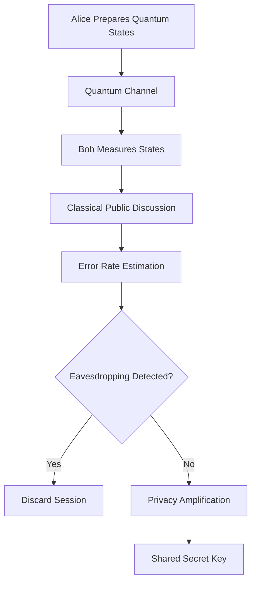
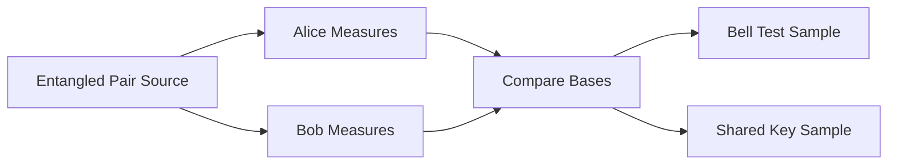

# Quantum Cryptography

Quantum cryptography studies how quantum information can support secure communication. It is different from post-quantum cryptography. Post-quantum cryptography uses classical algorithms designed to resist quantum attacks. Quantum cryptography uses physical quantum systems, such as photons or qubits, to detect eavesdropping and distribute secret keys.

In classical communication, an attacker may copy data without disturbing it. In quantum communication, unknown quantum states cannot be copied perfectly, and measurement changes the state. These principles make it possible to detect interception.

The two most important ideas are:

* **No-cloning theorem:** an unknown quantum state cannot be copied exactly.
* **Measurement disturbance:** observing a quantum state generally changes it.



## Quantum Key Distribution

Quantum Key Distribution (QKD) allows two parties, traditionally called Alice and Bob, to create a shared secret key. The key can then be used with classical symmetric encryption, such as a one-time pad or modern block ciphers.

QKD does not directly encrypt a message. It solves the key exchange problem. This distinction is important. The quantum channel distributes states. The classical channel is used for comparison, reconciliation, and verification.

The basic QKD workflow is:

1. Alice prepares quantum states.
2. Alice sends them to Bob through a quantum channel.
3. Bob measures each received state.
4. Alice and Bob publicly compare measurement bases, not the secret bit values.
5. They discard measurements where the bases do not match.
6. They estimate the error rate from a sample.
7. If the error rate is acceptable, they perform error correction and privacy amplification.
8. The remaining bits become the shared key.

### Mathematical Basis

The computational basis is:

$$
|0\rangle,\ |1\rangle
$$

The diagonal basis is:

$$
|+\rangle=\frac{|0\rangle+|1\rangle}{\sqrt{2}}
$$

$$
|-\rangle=\frac{|0\rangle-|1\rangle}{\sqrt{2}}
$$

If a qubit prepared in the computational basis is measured in the diagonal basis, the result is random. This uncertainty is the source of eavesdropping detection.

### HDQS Example: Basis Simulation

```python
from hdqs import QuantumCircuit, Simulator

def prepare_bit(bit, basis):
    circuit = QuantumCircuit(1, 1)
    if bit == 1:
        circuit.x(0)
    if basis == "x":
        circuit.h(0)
    return circuit

def measure_in_basis(circuit, basis):
    if basis == "x":
        circuit.h(0)
    circuit.measure(0, 0)
    return circuit

simulator = Simulator(shots=1)
circuit = prepare_bit(bit=1, basis="x")
measure_in_basis(circuit, basis="z")
print(simulator.run(circuit).counts())
```

This short experiment shows why mismatched bases create random outcomes. In a full QKD workflow, Alice and Bob keep only the measurements where their bases match.

## BB84 Protocol

BB84 is the first and most widely taught QKD protocol. It was introduced by Charles Bennett and Gilles Brassard in 1984.

BB84 uses four quantum states:

| Bit | Z Basis | X Basis |
| --- | ------- | ------- |
| 0 | $|0\rangle$ | $|+\rangle$ |
| 1 | $|1\rangle$ | $|-\rangle$ |

Alice randomly chooses a bit and a basis for each qubit. Bob randomly chooses a measurement basis for each received qubit. After transmission, Alice and Bob publicly compare only their basis choices. They keep the bit positions where the bases match.

### BB84 Steps

1. Alice generates random bits.
2. Alice generates random bases.
3. Alice encodes each bit into a qubit.
4. Bob randomly chooses measurement bases.
5. Bob measures each qubit.
6. Alice and Bob announce bases over a public channel.
7. They keep only matching-basis positions.
8. They compare a small subset to estimate the quantum bit error rate.
9. If the error rate is too high, they abort.
10. Otherwise, they perform reconciliation and privacy amplification.

### Eavesdropping Detection

Suppose Eve intercepts a qubit and measures it in the wrong basis. She collapses the state into a basis that may not match Alice's preparation. When Bob measures later, the error probability increases.

For intercept-resend attacks, BB84 introduces an error rate of about:

$$
25\%
$$

when Eve attacks every qubit. This makes eavesdropping statistically detectable.

### HDQS BB84 Simulation

```python
import random
from hdqs import QuantumCircuit, Simulator

def encode_bb84(bit, basis):
    circuit = QuantumCircuit(1, 1)
    if bit:
        circuit.x(0)
    if basis == "x":
        circuit.h(0)
    return circuit

def measure_bb84(circuit, basis):
    if basis == "x":
        circuit.h(0)
    circuit.measure(0, 0)
    return circuit

def bb84_rounds(rounds=32):
    simulator = Simulator(shots=1)
    alice_bits = [random.randint(0, 1) for _ in range(rounds)]
    alice_bases = [random.choice(["z", "x"]) for _ in range(rounds)]
    bob_bases = [random.choice(["z", "x"]) for _ in range(rounds)]
    bob_bits = []

    for bit, alice_basis, bob_basis in zip(alice_bits, alice_bases, bob_bases):
        circuit = encode_bb84(bit, alice_basis)
        measure_bb84(circuit, bob_basis)
        measured = simulator.run(circuit).most_likely()
        bob_bits.append(int(measured[-1]))

    sifted = [
        (a, b)
        for a, b, alice_basis, bob_basis in zip(alice_bits, bob_bits, alice_bases, bob_bases)
        if alice_basis == bob_basis
    ]
    return sifted

print(bb84_rounds())
```

This simulation produces a sifted key. In a more complete implementation, learners add noise, eavesdropping, error-rate estimation, and privacy amplification.

## E91 Protocol

The E91 protocol, proposed by Artur Ekert in 1991, uses entanglement. Instead of Alice preparing individual states and sending them to Bob, a source distributes entangled qubit pairs.

A common entangled state is:

$$
|\Phi^+\rangle=\frac{|00\rangle+|11\rangle}{\sqrt{2}}
$$

Alice receives one qubit and Bob receives the other. They measure their qubits using selected bases. Their correlated results produce shared key bits. Some measurement settings are used to test Bell inequality violations, which provide evidence that the correlations are genuinely quantum.



### HDQS Entanglement Example

```python
from hdqs import QuantumCircuit, Simulator

def e91_pair():
    circuit = QuantumCircuit(2, 2)
    circuit.h(0)
    circuit.cx(0, 1)
    circuit.measure(0, 0)
    circuit.measure(1, 1)
    return circuit

simulator = Simulator(shots=1024)
print(simulator.run(e91_pair()).counts())
```

The expected counts are dominated by `00` and `11`. That correlation is the starting point for entanglement-based key distribution.

## Quantum Teleportation

Quantum teleportation transfers an unknown quantum state from one qubit to another using entanglement and classical communication. It does not transport matter, and it does not allow faster-than-light communication.

Teleportation uses three qubits:

* Qubit 0 contains the unknown state $|\psi\rangle$.
* Qubits 1 and 2 form an entangled Bell pair.
* Alice owns qubits 0 and 1.
* Bob owns qubit 2.

The unknown state is:

$$
|\psi\rangle=\alpha|0\rangle+\beta|1\rangle
$$

Alice performs a Bell measurement on her two qubits and sends two classical bits to Bob. Bob applies corrections:

| Alice Result | Bob Correction |
| ------------ | -------------- |
| 00 | Identity |
| 01 | X |
| 10 | Z |
| 11 | X then Z |

### HDQS Teleportation Example

```python
from hdqs import QuantumCircuit, Simulator

def teleportation():
    circuit = QuantumCircuit(3, 3)

    # Prepare an example state to teleport.
    circuit.h(0)

    # Create Bell pair between qubits 1 and 2.
    circuit.h(1)
    circuit.cx(1, 2)

    # Bell measurement on qubits 0 and 1.
    circuit.cx(0, 1)
    circuit.h(0)
    circuit.measure(0, 0)
    circuit.measure(1, 1)

    # Conditional corrections.
    circuit.cx(1, 2)
    circuit.cz(0, 2)

    circuit.measure(2, 2)
    return circuit

simulator = Simulator(shots=1024)
print(simulator.run(teleportation()).counts())
```

Teleportation is essential for quantum networking, distributed quantum computing, and secure quantum communication architectures.

## Quantum Communication

Quantum communication includes QKD, teleportation, entanglement distribution, quantum repeaters, and future quantum internet designs. The long-term goal is to connect quantum devices across distance while preserving fragile quantum states.

Practical quantum communication faces several challenges:

* Photon loss in optical fiber.
* Noise in detectors.
* Limited distance without repeaters.
* Synchronization between sender and receiver.
* Authentication of the classical channel.
* Integration with existing network infrastructure.

### Security Analysis

Security in QKD depends on both physics and implementation. The theoretical protocol may be secure, but real devices can leak information through side channels.

Important security checks include:

* Quantum bit error rate estimation.
* Device calibration.
* Detector efficiency analysis.
* Authentication of classical messages.
* Privacy amplification.
* Protection against photon-number-splitting attacks.

The quantum bit error rate is:

$$
QBER = \frac{\text{number of mismatched sample bits}}{\text{number of compared sample bits}}
$$

If QBER exceeds the acceptable threshold, Alice and Bob abort the session.

## Key Takeaways

* Quantum cryptography uses physical quantum principles to support secure communication.
* QKD distributes keys; it does not directly encrypt messages.
* BB84 uses random bases and detects eavesdropping through measurement disturbance.
* E91 uses entangled states and Bell-test correlations.
* Quantum teleportation transfers quantum state information using entanglement and classical bits.
* Practical security requires protocol analysis and device-level security checks.

## Summary

This module introduced the foundations of quantum cryptography and secure quantum communication. BB84 demonstrates prepare-and-measure key distribution, while E91 uses entanglement. Quantum teleportation shows how entanglement and classical communication can transfer an unknown quantum state. HDQS simulations help learners observe basis mismatch, Bell correlations, and simple QKD workflows before studying real-world hardware constraints.

## Knowledge Check

1. How is quantum cryptography different from post-quantum cryptography?
2. What does the no-cloning theorem say?
3. Why does BB84 discard measurements with mismatched bases?
4. What error rate can intercept-resend attacks introduce in BB84?
5. How does E91 use entanglement?
6. Why does teleportation require classical communication?
7. What is QBER?
8. Why must the classical channel be authenticated?
9. What are two practical device-level risks in QKD?
10. How can HDQS simulations help learners understand QKD?

## Practical Exercises

1. Simulate BB84 for 16, 64, and 256 rounds and compare sifted key length.
2. Add an intercept-resend attacker to the BB84 simulation and calculate QBER.
3. Build a Bell pair circuit and verify correlated measurement outcomes.
4. Implement a teleportation circuit for $|+\rangle$ and inspect Bob's final state.
5. Write a short security report explaining why QKD still needs classical authentication.
6. Compare BB84 and E91 in a table.
7. Extend the BB84 code with privacy amplification using a hash function.

## References

* C. H. Bennett and G. Brassard, "Quantum cryptography: Public key distribution and coin tossing"
* A. K. Ekert, "Quantum cryptography based on Bell's theorem"
* Michael A. Nielsen and Isaac L. Chuang, *Quantum Computation and Quantum Information*
* IBM Quantum Documentation: Quantum Teleportation
* ETSI Quantum-Safe Cryptography and Quantum Key Distribution resources
