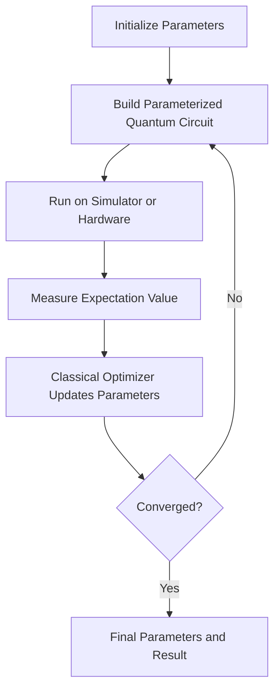
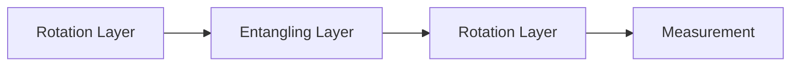

# Variational Quantum Computing

Variational quantum computing is one of the most important approaches for current noisy quantum hardware. These algorithms combine a quantum circuit with a classical optimizer. The quantum processor prepares states and estimates objective values. The classical processor updates circuit parameters.

This model is useful because present-day quantum computers are limited by noise, short coherence time, and circuit depth. Variational methods are designed to work with relatively shallow circuits.



## Parameterized Quantum Circuits

A parameterized quantum circuit contains gates controlled by tunable angles. These circuits are also called ansatz circuits.

Examples of parameterized gates include:

$$
R_x(\theta)=
\begin{bmatrix}
\cos(\theta/2) & -i\sin(\theta/2) \\
-i\sin(\theta/2) & \cos(\theta/2)
\end{bmatrix}
$$

$$
R_y(\theta)=
\begin{bmatrix}
\cos(\theta/2) & -\sin(\theta/2) \\
\sin(\theta/2) & \cos(\theta/2)
\end{bmatrix}
$$

The circuit prepares a state:

$$
|\psi(\theta)\rangle = U(\theta)|0\rangle
$$

The optimizer searches for parameter values that minimize or maximize an objective function:

$$
C(\theta)=\langle \psi(\theta)|H|\psi(\theta)\rangle
$$

where $H$ is an operator representing the problem.

### Hardware-Efficient Ansatz

A hardware-efficient ansatz uses gates that are native or easy to implement on the target hardware. It usually contains repeated layers:

* Single-qubit rotations.
* Entangling gates.
* Another rotation layer.
* Measurement.



### HDQS Example

```python
from hdqs import QuantumCircuit

def hardware_efficient_ansatz(num_qubits, layers, parameters):
    circuit = QuantumCircuit(num_qubits)
    index = 0

    for _ in range(layers):
        for q in range(num_qubits):
            circuit.ry(parameters[index], q)
            index += 1
            circuit.rz(parameters[index], q)
            index += 1

        for q in range(num_qubits - 1):
            circuit.cx(q, q + 1)

    return circuit
```

This design is flexible, but more layers do not always mean better performance. Deep circuits can be damaged by noise and may become difficult to optimize.

## VQE

The Variational Quantum Eigensolver (VQE) estimates the lowest eigenvalue of a Hamiltonian. It is often introduced through quantum chemistry because molecular ground-state energy can be written as an eigenvalue problem.

The goal is:

$$
E_0=\min_{\theta}\langle \psi(\theta)|H|\psi(\theta)\rangle
$$

where:

* $H$ is the Hamiltonian.
* $|\psi(\theta)\rangle$ is the parameterized quantum state.
* $E_0$ is the estimated ground-state energy.

### VQE Workflow

1. Convert the problem into a Hamiltonian.
2. Choose an ansatz.
3. Initialize parameters.
4. Run the circuit and measure expectation values.
5. Use a classical optimizer to update parameters.
6. Repeat until convergence.

### Expectation Values

A Hamiltonian is often decomposed into Pauli terms:

$$
H = c_0 I + c_1 Z_0 + c_2 Z_1 + c_3 X_0X_1
$$

The energy is:

$$
E(\theta)=\sum_i c_i \langle P_i \rangle
$$

Each Pauli term may require measurements in a different basis.

### HDQS VQE Example

```python
from hdqs import Simulator
from hdqs.optimizers import COBYLA

def ansatz(theta):
    circuit = QuantumCircuit(2)
    circuit.ry(theta[0], 0)
    circuit.ry(theta[1], 1)
    circuit.cx(0, 1)
    return circuit

hamiltonian = [
    (-1.05, "II"),
    (0.39, "ZI"),
    (-0.39, "IZ"),
    (-0.01, "ZZ"),
    (0.18, "XX"),
]

simulator = Simulator(shots=4096)

def energy(theta):
    circuit = ansatz(theta)
    return simulator.expectation(circuit, hamiltonian)

optimizer = COBYLA(maxiter=100)
result = optimizer.minimize(energy, initial_point=[0.1, 0.2])
print(result.value)
print(result.parameters)
```

This example uses a small Hamiltonian format to show the VQE loop. In a full chemistry workflow, the Hamiltonian is generated from molecular data and mapped to qubits using transformations such as Jordan-Wigner or Bravyi-Kitaev.

## QAOA

The Quantum Approximate Optimization Algorithm (QAOA) is designed for combinatorial optimization problems. It alternates between two operators:

* A cost operator that encodes the problem.
* A mixer operator that explores possible solutions.

For depth $p$, the QAOA state is:

$$
|\gamma,\beta\rangle =
e^{-i\beta_p H_M}e^{-i\gamma_p H_C}
...
e^{-i\beta_1 H_M}e^{-i\gamma_1 H_C}|+\rangle^{\otimes n}
$$

where:

* $H_C$ is the cost Hamiltonian.
* $H_M$ is the mixer Hamiltonian.
* $\gamma$ and $\beta$ are trainable parameters.

### Max-Cut Example

In Max-Cut, the goal is to divide graph vertices into two groups so that as many edges as possible cross between groups.

For an edge $(i,j)$, the cost term is:

$$
\frac{1-Z_iZ_j}{2}
$$

The total cost Hamiltonian is:

$$
H_C=\sum_{(i,j)\in E}\frac{1-Z_iZ_j}{2}
$$

### HDQS QAOA Example

```python
from hdqs import QuantumCircuit, Simulator
from hdqs.optimizers import SPSA

edges = [(0, 1), (1, 2), (2, 3), (3, 0)]

def qaoa_circuit(gamma, beta):
    circuit = QuantumCircuit(4, 4)

    for q in range(4):
        circuit.h(q)

    for i, j in edges:
        circuit.cx(i, j)
        circuit.rz(2 * gamma, j)
        circuit.cx(i, j)

    for q in range(4):
        circuit.rx(2 * beta, q)
        circuit.measure(q, q)

    return circuit

def maxcut_score(bitstring):
    return sum(1 for i, j in edges if bitstring[i] != bitstring[j])

simulator = Simulator(shots=2048)

def objective(params):
    gamma, beta = params
    counts = simulator.run(qaoa_circuit(gamma, beta)).counts()
    average = 0
    total = sum(counts.values())
    for bitstring, count in counts.items():
        average += maxcut_score(bitstring) * count / total
    return -average

result = SPSA(maxiter=80).minimize(objective, initial_point=[0.2, 0.4])
print(result.parameters)
```

QAOA is useful because it connects quantum circuits to real optimization tasks such as scheduling, routing, resource allocation, and portfolio selection.

## Hybrid Quantum-Classical Computing

Hybrid quantum-classical computing divides work between classical and quantum processors. The quantum circuit evaluates a state or probability distribution. Classical software updates the parameters, manages data, and decides when to stop.

A typical workflow looks like this:

```text
Problem Definition
      |
Classical Preprocessing
      |
Quantum Circuit Construction
      |
Quantum Execution
      |
Measurement
      |
Classical Optimization
      |
Final Result
```

This model is important because current quantum devices are not large enough or stable enough to solve full applications independently. Hybrid systems use quantum circuits as specialized subroutines inside broader classical workflows.

### Practical Optimization

In practical HDQS labs, optimization requires more than calling an optimizer. Learners must consider:

* Parameter initialization.
* Circuit depth.
* Number of shots.
* Noise level.
* Measurement cost.
* Optimizer choice.
* Convergence criteria.

Gradient-free methods such as COBYLA, Nelder-Mead, and SPSA are often useful when measurement noise is high. Gradient-based methods can be effective when gradients are available and stable.

## Gradient Optimization

A gradient measures how the objective changes as parameters change:

$$
\nabla C(\theta)=
\left[
\frac{\partial C}{\partial \theta_1},
\frac{\partial C}{\partial \theta_2},
...,
\frac{\partial C}{\partial \theta_n}
\right]
$$

For many parameterized gates, gradients can be estimated using the parameter-shift rule:

$$
\frac{\partial C}{\partial \theta}
=
\frac{C(\theta+\pi/2)-C(\theta-\pi/2)}{2}
$$

### HDQS Parameter-Shift Example

```python
import math

def parameter_shift_gradient(cost, theta, index):
    plus = list(theta)
    minus = list(theta)
    plus[index] += math.pi / 2
    minus[index] -= math.pi / 2
    return 0.5 * (cost(plus) - cost(minus))

theta = [0.1, 0.2, 0.3]
gradient_0 = parameter_shift_gradient(energy, theta, 0)
print(gradient_0)
```

Gradient methods can speed up training, but each gradient component requires additional circuit evaluations. This cost becomes significant for large circuits.

## Barren Plateaus

A barren plateau occurs when gradients become extremely small across large regions of the parameter space. When this happens, optimization becomes difficult because the classical optimizer receives almost no useful direction.

Common causes include:

* Excessively deep random circuits.
* Too many qubits.
* Poor ansatz design.
* Global cost functions that wash out local information.
* Noise that suppresses useful gradients.

Mitigation strategies include:

* Use problem-inspired ansatz circuits.
* Keep circuits shallow.
* Initialize parameters carefully.
* Use local cost functions where appropriate.
* Reduce noise through error mitigation.
* Train layer by layer.

Understanding barren plateaus is essential for realistic quantum machine learning and variational algorithm design.

## Hardware-Efficient Ansatze

Hardware-efficient ansatze are designed around the connectivity and native gates of a quantum device. They reduce compilation overhead and circuit depth.

Advantages:

* Easier to run on real hardware.
* Lower circuit depth.
* Flexible structure.
* Good for experimentation.

Limitations:

* May not reflect the problem structure.
* Can suffer from barren plateaus.
* May require many parameters.
* Interpretability can be limited.

For chemistry, a problem-inspired ansatz may be better. For exploratory optimization or QML, hardware-efficient circuits are often a reasonable starting point.

## Key Takeaways

* Variational algorithms combine quantum circuits with classical optimization.
* VQE estimates ground-state energies by minimizing expectation values.
* QAOA solves combinatorial optimization problems using cost and mixer layers.
* Parameterized circuits are the trainable models of variational computing.
* Gradient optimization can use the parameter-shift rule.
* Barren plateaus make training difficult when gradients vanish.
* Hardware-efficient ansatze reduce circuit depth but may not encode problem structure.

## Summary

This module explained the core ideas behind variational quantum computing. VQE and QAOA are two major algorithms for near-term devices. Both rely on parameterized circuits, measurement, and classical optimization. HDQS examples show how learners can build ansatz circuits, estimate objective values, and iterate toward better parameters. Practical success depends on circuit design, noise awareness, optimizer choice, and careful evaluation.

## Knowledge Check

1. Why are variational algorithms important for noisy quantum hardware?
2. What is an ansatz?
3. What quantity does VQE minimize?
4. How does QAOA alternate between cost and mixer operators?
5. What is the purpose of the classical optimizer?
6. What is the parameter-shift rule used for?
7. What is a barren plateau?
8. Why can hardware-efficient ansatze be both useful and risky?
9. How does shot count affect objective estimation?
10. What is the difference between VQE and QAOA?

## Practical Exercises

1. Build a two-qubit hardware-efficient ansatz in HDQS.
2. Estimate the expectation value of a simple Hamiltonian containing `ZI`, `IZ`, and `ZZ`.
3. Implement a VQE loop using a gradient-free optimizer.
4. Build a QAOA circuit for a triangle graph.
5. Compare QAOA performance for depths $p=1$ and $p=2$.
6. Use the parameter-shift rule to estimate one gradient component.
7. Write a short analysis explaining how barren plateaus affect training.
8. Design an ansatz that follows a specific hardware connectivity map.

## References

* Alberto Peruzzo et al., "A variational eigenvalue solver on a photonic quantum processor"
* Edward Farhi et al., "A Quantum Approximate Optimization Algorithm"
* Jarrod R. McClean et al., "Barren plateaus in quantum neural network training landscapes"
* IBM Quantum Documentation: Variational Algorithms
* Qiskit Nature and Qiskit Optimization documentation
