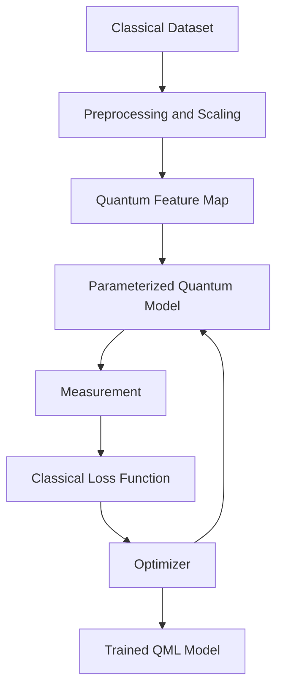
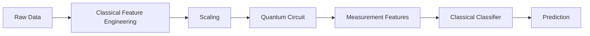

# Quantum Machine Learning

Quantum Machine Learning (QML) studies how quantum computing can support machine learning workflows. It does not replace classical machine learning. Instead, it explores whether quantum state spaces, quantum kernels, and hybrid optimization can help solve selected learning problems.

Most practical QML today is hybrid. Classical software prepares data, manages training, and evaluates performance. Quantum circuits encode features, apply trainable transformations, and return measurements.



## Quantum Data Encoding

Quantum data encoding converts classical data into quantum states. This step is critical because a quantum model cannot process ordinary arrays directly. Data must be represented through amplitudes, angles, basis states, or other circuit parameters.

Common encoding methods include:

* **Basis encoding:** classical bits are mapped directly to computational basis states.
* **Angle encoding:** features control rotation angles.
* **Amplitude encoding:** normalized feature values become state amplitudes.
* **Feature-map encoding:** data controls a structured circuit designed to create useful separations.

### Angle Encoding

For a feature vector:

$$
x=[x_1,x_2,...,x_n]
$$

an angle encoding circuit may apply:

$$
R_y(x_i)
$$

to qubit $i$.

```python
from hdqs import QuantumCircuit

def angle_encode(features):
    circuit = QuantumCircuit(len(features))
    for index, value in enumerate(features):
        circuit.ry(value, index)
    return circuit
```

Angle encoding is easy to implement and works well for introductory QML experiments. The data should usually be scaled into a stable range such as $[0,\pi]$.

### Amplitude Encoding

Amplitude encoding represents data as amplitudes:

$$
|x\rangle = \sum_i x_i |i\rangle
$$

The vector must be normalized:

$$
\sum_i |x_i|^2=1
$$

Amplitude encoding can represent many features with fewer qubits, but state preparation can be expensive. Learners should understand that compact representation does not automatically mean efficient computation.

## Quantum Feature Maps

A quantum feature map transforms classical data into a quantum state:

$$
|\phi(x)\rangle = U_{\phi}(x)|0\rangle
$$

The purpose is to map data into a high-dimensional Hilbert space where patterns may become easier to separate.

Feature maps often include:

* Data-dependent rotations.
* Entangling gates.
* Repeated layers.
* Nonlinear phase terms.

### Example Feature Map

```python
from hdqs import QuantumCircuit

def feature_map(features):
    circuit = QuantumCircuit(len(features))

    for q, value in enumerate(features):
        circuit.h(q)
        circuit.rz(value, q)

    for q in range(len(features) - 1):
        circuit.cx(q, q + 1)
        circuit.rz(features[q] * features[q + 1], q + 1)
        circuit.cx(q, q + 1)

    return circuit
```

This circuit uses single-feature rotations and pairwise feature interactions. The entangling operations allow the model to represent relationships between features.

## Quantum Kernels

Kernel methods compare data points by measuring similarity in a feature space. In QML, a quantum kernel compares two encoded quantum states:

$$
K(x,z)=|\langle \phi(x)|\phi(z)\rangle|^2
$$

If the quantum feature map creates a useful representation, the kernel matrix can be used with classical algorithms such as support vector machines.

### HDQS Kernel Estimation

```python
from hdqs import Simulator

def kernel_circuit(x, z):
    circuit = feature_map(x)
    inverse = feature_map(z).inverse()
    circuit.compose(inverse)
    circuit.measure_all()
    return circuit

def quantum_kernel(x, z, shots=2048):
    simulator = Simulator(shots=shots)
    counts = simulator.run(kernel_circuit(x, z)).counts()
    zero_state = "0" * len(x)
    return counts.get(zero_state, 0) / shots

print(quantum_kernel([0.2, 0.7], [0.3, 0.6]))
```

The probability of measuring the all-zero state estimates the overlap between the two encoded states.

## Variational Quantum Classifiers

A Variational Quantum Classifier (VQC) is a trainable quantum model used for classification. It usually contains three parts:

1. A feature map that encodes input data.
2. A trainable ansatz with parameters.
3. A measurement rule that maps outcomes to labels.

For binary classification, a simple prediction can use the expectation value of $Z$ on one qubit:

$$
\hat{y}=\text{sign}(\langle Z_0\rangle)
$$

The model is trained by minimizing a loss function:

$$
L(\theta)=\frac{1}{m}\sum_{i=1}^{m}\ell(y_i,\hat{y}_i)
$$

### HDQS VQC Example

```python
from hdqs import QuantumCircuit, Simulator
from hdqs.optimizers import SPSA

def vqc_circuit(features, theta):
    circuit = feature_map(features)
    circuit.ry(theta[0], 0)
    circuit.ry(theta[1], 1)
    circuit.cx(0, 1)
    circuit.ry(theta[2], 0)
    circuit.measure(0, 0)
    return circuit

simulator = Simulator(shots=1024)

def predict(features, theta):
    counts = simulator.run(vqc_circuit(features, theta)).counts()
    p0 = counts.get("0", 0) / 1024
    p1 = counts.get("1", 0) / 1024
    return 1 if p1 > p0 else 0

def loss(theta, dataset):
    errors = 0
    for features, label in dataset:
        errors += int(predict(features, theta) != label)
    return errors / len(dataset)

training_data = [
    ([0.1, 0.2], 0),
    ([0.2, 0.3], 0),
    ([1.2, 1.0], 1),
    ([1.4, 1.1], 1),
]

result = SPSA(maxiter=60).minimize(lambda t: loss(t, training_data), [0.1, 0.2, 0.3])
print(result.parameters)
```

This example is intentionally small. The goal is to understand the pipeline: encode data, run circuit, measure, compute loss, update parameters.

## Quantum Neural Networks

Quantum neural networks are parameterized quantum models inspired by neural network training. The word "neural" does not mean the circuit behaves like a biological neuron. It means the circuit has trainable parameters and can be optimized from data.

A quantum neural network may contain:

* Data encoding layers.
* Trainable rotation layers.
* Entangling layers.
* Measurement layers.
* Classical post-processing.

The output of a quantum neural network is often an expectation value:

$$
f_{\theta}(x)=\langle \psi(x,\theta)|M|\psi(x,\theta)\rangle
$$

where $M$ is a measurement operator.

### Hybrid Classical-Quantum Pipelines

Most practical QML systems combine classical and quantum stages.



Hybrid pipelines are useful because classical models are powerful and mature. Quantum circuits can be inserted as feature extractors, kernels, or specialized trainable components.

### HDQS Hybrid Example

```python
from hdqs import Simulator
from sklearn.linear_model import LogisticRegression

def quantum_features(features, theta):
    circuit = vqc_circuit(features, theta)
    result = Simulator(shots=1024).run(circuit)
    counts = result.counts()
    return [
        counts.get("0", 0) / 1024,
        counts.get("1", 0) / 1024,
    ]

theta = [0.4, 0.7, 0.2]
X_quantum = [quantum_features(x, theta) for x, y in training_data]
y = [y for x, y in training_data]

classifier = LogisticRegression()
classifier.fit(X_quantum, y)
print(classifier.predict(X_quantum))
```

This design treats the quantum circuit as a feature generator. A classical classifier then learns from the measured quantum features.

## Practical Considerations

QML is an active research field. Learners should avoid assuming automatic speedup. A strong QML experiment should include:

* Classical baselines.
* Clear dataset size.
* Defined metrics.
* Repeated trials.
* Noise analysis.
* Circuit depth reporting.
* Training curve visualization.

Important metrics include:

$$
Accuracy=\frac{TP+TN}{TP+TN+FP+FN}
$$

$$
Precision=\frac{TP}{TP+FP}
$$

$$
Recall=\frac{TP}{TP+FN}
$$

QML models should be evaluated with the same rigor as classical models.

## Training Workflow in HDQS

A strong QML workflow in HDQS should be treated like an experiment. The learner should define a dataset, choose an encoding strategy, select a circuit, train parameters, and compare results with a classical baseline.

```python
history = []

def training_callback(step, params, value):
    history.append({"step": step, "loss": value, "params": list(params)})

result = optimizer.minimize(
    objective_function,
    initial_point=[0.1, 0.2, 0.3],
    callback=training_callback,
)

print(history[-1])
```

The training history should be included in the final report. A model that reaches high accuracy once may not be reliable. Learners should repeat training with different initial parameters and report average performance.

### Reporting Checklist

Every HDQS QML experiment should document:

* Dataset description.
* Feature scaling method.
* Encoding circuit.
* Trainable ansatz.
* Optimizer and hyperparameters.
* Number of shots.
* Accuracy and loss curves.
* Classical baseline.
* Limitations and next steps.

## Key Takeaways

* QML combines quantum circuits with machine learning workflows.
* Data encoding determines how classical features enter a quantum model.
* Quantum feature maps create Hilbert-space representations of data.
* Quantum kernels estimate similarity between encoded states.
* Variational quantum classifiers train circuit parameters from labeled data.
* Quantum neural networks are parameterized circuits used as trainable models.
* Hybrid pipelines combine quantum feature extraction with classical learning.

## Summary

This module introduced the practical structure of quantum machine learning. Learners studied data encoding, feature maps, quantum kernels, variational classifiers, quantum neural networks, and hybrid pipelines. HDQS examples showed how circuits can encode features, estimate kernels, classify simple datasets, and provide measured features to classical models. The module emphasizes careful experimentation, classical comparison, and realistic interpretation of results.

## Knowledge Check

1. Why must classical data be encoded before a quantum circuit can process it?
2. What is the difference between angle encoding and amplitude encoding?
3. What does a quantum feature map do?
4. How is a quantum kernel defined?
5. What are the main parts of a variational quantum classifier?
6. Why are QML workflows usually hybrid?
7. What is an expectation value used for in a quantum neural network?
8. Why should QML models be compared with classical baselines?
9. What risks arise from deep trainable quantum circuits?
10. Which metrics can be used to evaluate a classifier?

## Practical Exercises

1. Implement angle encoding for a two-feature dataset.
2. Build a feature map with one entangling layer.
3. Estimate a quantum kernel value for two data points.
4. Train a small VQC on four labeled examples.
5. Compare VQC predictions against logistic regression on the same data.
6. Plot training loss across optimizer iterations.
7. Add simulated noise and measure its effect on accuracy.
8. Write a report explaining whether the quantum model improved the baseline.

## References

* Maria Schuld and Francesco Petruccione, *Supervised Learning with Quantum Computers*
* IBM Quantum Documentation: Quantum Machine Learning
* Qiskit Machine Learning documentation
* Vojtech Havlicek et al., "Supervised learning with quantum-enhanced feature spaces"
* Jarrod R. McClean et al., "Barren plateaus in quantum neural network training landscapes"
