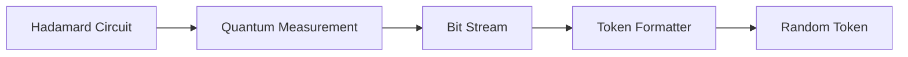
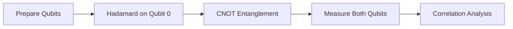
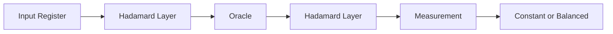
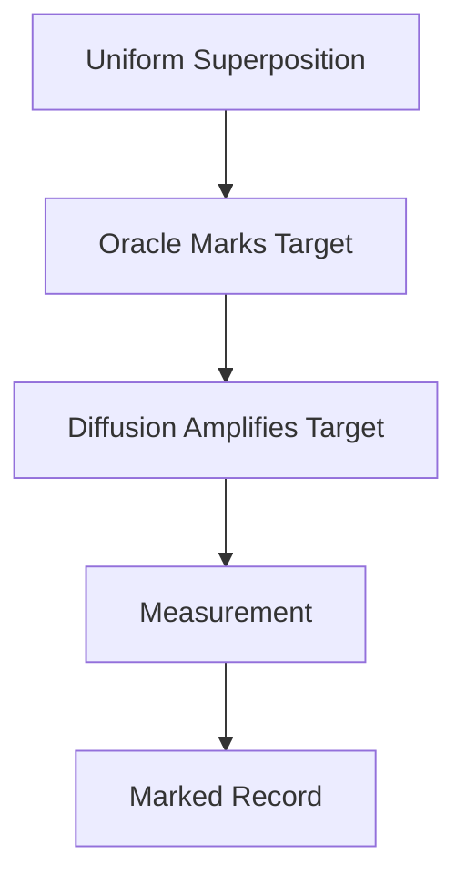
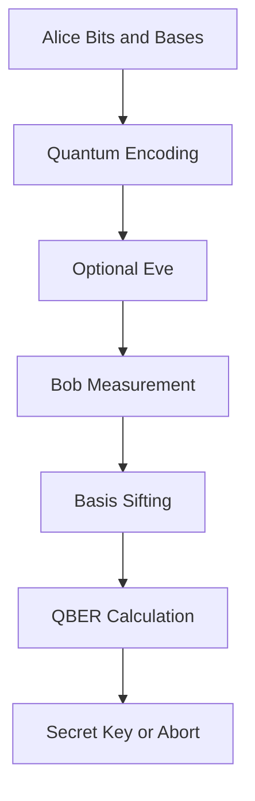
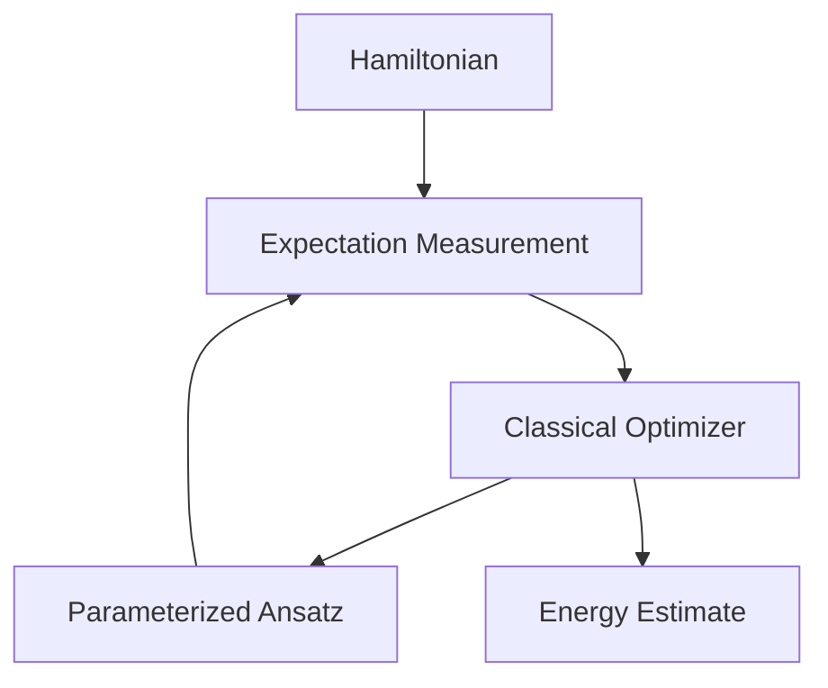
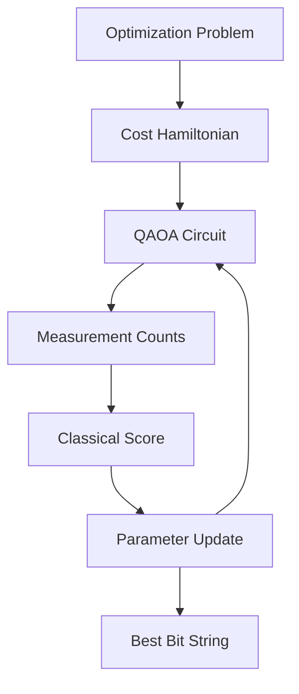
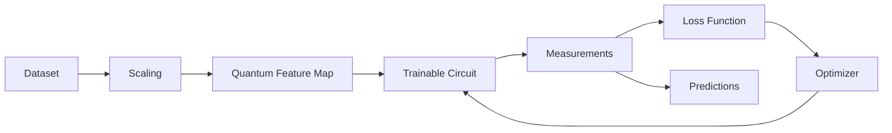

# Projects

## Projects

The HDQS project track converts theory into implementation practice. Each project is designed to produce a portfolio-ready artifact: a working circuit, code notebook, results table, interpretation, and short technical report.

Every project should include:

* A problem statement.
* A circuit diagram.
* Source code.
* Measurement results.
* Comparison with a classical baseline where relevant.
* A short discussion of limitations.

## Project 1: Quantum Randomness and Secure Token Generator

### Objectives

Build a quantum random number generator and use its measured bits to create secure tokens.

### Background

Classical pseudo-random generators use deterministic algorithms. Quantum measurement provides intrinsic randomness when a qubit is prepared in superposition and measured.

### Architecture



### Implementation Steps

1. Create a circuit with multiple qubits.
2. Apply Hadamard gates to all qubits.
3. Measure all qubits.
4. Convert measured bit strings into random tokens.
5. Run frequency analysis.

### Source Code

```python
from hdqs import QuantumCircuit, Simulator

def random_bits(width=16, shots=1):
    circuit = QuantumCircuit(width, width)
    for q in range(width):
        circuit.h(q)
        circuit.measure(q, q)
    result = Simulator(shots=shots).run(circuit)
    return result.most_likely()

token = hex(int(random_bits(32), 2))[2:]
print(token)
```

### Expected Output

A hexadecimal token such as:

```text
9f3a21c4
```

Repeated runs should produce different values.

### Challenges

* Simulator randomness may differ from hardware randomness.
* Real hardware can have measurement bias.
* Tokens require enough bits for meaningful security.

### Extensions

* Add bias correction.
* Generate API keys.
* Compare simulator and hardware distributions.

### Evaluation Criteria

* Correct use of superposition and measurement.
* Clean token generation.
* Frequency analysis included.
* Limitations discussed clearly.

## Project 2: Bell State Entanglement Analyzer

### Objectives

Generate Bell states and analyze their measurement correlations.

### Background

Bell states are maximally entangled two-qubit states. They demonstrate correlations that cannot be explained by independent classical bits.

### Architecture



### Implementation Steps

1. Build a two-qubit circuit.
2. Apply `H` to the first qubit.
3. Apply `CNOT` from qubit 0 to qubit 1.
4. Measure both qubits.
5. Plot counts and calculate correlation.

### Source Code

```python
from hdqs import QuantumCircuit, Simulator

circuit = QuantumCircuit(2, 2)
circuit.h(0)
circuit.cx(0, 1)
circuit.measure(0, 0)
circuit.measure(1, 1)

counts = Simulator(shots=2048).run(circuit).counts()
print(counts)
```

### Expected Output

Most results should be `00` and `11`.

### Challenges

* Bit ordering may vary by platform.
* Hardware noise may produce `01` and `10`.
* Correlation must be interpreted statistically.

### Extensions

* Generate all four Bell states.
* Add measurement in different bases.
* Compare simulator and noisy backend results.

### Evaluation Criteria

* Correct Bell circuit.
* Clear explanation of entanglement.
* Counts interpreted correctly.
* Noise behavior discussed.

## Project 3: Deutsch-Jozsa Oracle Classifier

### Objectives

Implement Deutsch-Jozsa circuits for constant and balanced functions.

### Background

Deutsch-Jozsa shows how a quantum circuit can classify a promised function with one oracle query.

### Architecture



### Implementation Steps

1. Prepare input and output qubits.
2. Create one constant oracle.
3. Create one balanced oracle.
4. Run each circuit.
5. Compare measured bit strings.

### Source Code

```python
from hdqs import QuantumCircuit, Simulator

def deutsch_jozsa(n, balanced=True):
    circuit = QuantumCircuit(n + 1, n)
    output = n
    circuit.x(output)

    for q in range(n + 1):
        circuit.h(q)

    if balanced:
        for q in range(n):
            circuit.cx(q, output)

    for q in range(n):
        circuit.h(q)
        circuit.measure(q, q)

    return circuit

simulator = Simulator(shots=1024)
print(simulator.run(deutsch_jozsa(3, balanced=False)).counts())
print(simulator.run(deutsch_jozsa(3, balanced=True)).counts())
```

### Expected Output

The constant oracle should produce all zeros. The balanced oracle should produce at least one nonzero bit.

### Challenges

* Oracle construction must match the function promise.
* Students must distinguish function output from phase information.

### Extensions

* Build multiple balanced oracles.
* Add diagrams for each oracle.
* Compare classical query count.

### Evaluation Criteria

* Both oracle types implemented.
* Correct classification logic.
* Explanation of phase kickback included.

## Project 4: Grover Search for Marked Records

### Objectives

Use Grover's algorithm to amplify a marked state in a small search space.

### Background

Grover's algorithm provides a quadratic improvement for unstructured search. It uses an oracle and a diffusion operator.

### Architecture



### Implementation Steps

1. Create a two-qubit search space.
2. Mark a target state.
3. Apply the diffusion operator.
4. Measure the output.
5. Compare target probability before and after amplification.

### Source Code

```python
from hdqs import QuantumCircuit, Simulator

def grover_target_11():
    circuit = QuantumCircuit(2, 2)
    circuit.h(0)
    circuit.h(1)
    circuit.cz(0, 1)
    circuit.h(0)
    circuit.h(1)
    circuit.x(0)
    circuit.x(1)
    circuit.cz(0, 1)
    circuit.x(0)
    circuit.x(1)
    circuit.h(0)
    circuit.h(1)
    circuit.measure(0, 0)
    circuit.measure(1, 1)
    return circuit

print(Simulator(shots=1024).run(grover_target_11()).counts())
```

### Expected Output

The marked state should dominate the measurement distribution.

### Challenges

* Diffusion operators are easy to implement incorrectly.
* Too many iterations can reduce success probability.

### Extensions

* Search over three qubits.
* Mark a different target.
* Plot success probability by iteration count.

### Evaluation Criteria

* Correct oracle and diffusion circuit.
* Probability comparison included.
* Iteration count explained.

## Project 5: BB84 Quantum Key Distribution Simulator

### Objectives

Simulate BB84 and detect an intercept-resend eavesdropper.

### Background

BB84 uses random bases to distribute secret keys. Eavesdropping creates detectable errors.

### Architecture



### Implementation Steps

1. Generate random Alice bits and bases.
2. Encode qubits.
3. Optionally simulate Eve measuring in random bases.
4. Let Bob measure in random bases.
5. Keep matching-basis bits.
6. Estimate QBER.

### Source Code

```python
import random

def qber(alice_sample, bob_sample):
    errors = sum(a != b for a, b in zip(alice_sample, bob_sample))
    return errors / len(alice_sample)

alice = [random.randint(0, 1) for _ in range(32)]
bob = alice.copy()

# Simulated eavesdropping noise for demonstration.
for i in range(len(bob)):
    if random.random() < 0.25:
        bob[i] ^= 1

print(qber(alice[:16], bob[:16]))
```

### Expected Output

Without Eve, QBER should be low. With intercept-resend behavior, QBER should increase.

### Challenges

* A simulator must model basis mismatch carefully.
* Real QKD also requires authentication and privacy amplification.

### Extensions

* Add privacy amplification.
* Plot QBER as Eve's attack rate changes.
* Compare BB84 with E91.

### Evaluation Criteria

* Sifting implemented correctly.
* QBER calculated correctly.
* Eavesdropping analysis included.

## Project 6: VQE Molecular Energy Estimator

### Objectives

Implement a small VQE workflow to estimate a Hamiltonian's minimum energy.

### Background

VQE is widely studied for quantum chemistry and near-term quantum simulation.

### Architecture



### Implementation Steps

1. Define a small Hamiltonian.
2. Build a parameterized ansatz.
3. Estimate expectation values.
4. Use a classical optimizer.
5. Report final energy and parameters.

### Source Code

```python
from hdqs import QuantumCircuit, Simulator
from hdqs.optimizers import COBYLA

def ansatz(theta):
    circuit = QuantumCircuit(2)
    circuit.ry(theta[0], 0)
    circuit.ry(theta[1], 1)
    circuit.cx(0, 1)
    return circuit

hamiltonian = [(-1.05, "II"), (0.39, "ZI"), (-0.39, "IZ"), (0.18, "XX")]
simulator = Simulator(shots=4096)

def cost(theta):
    return simulator.expectation(ansatz(theta), hamiltonian)

result = COBYLA(maxiter=100).minimize(cost, [0.1, 0.2])
print(result.value, result.parameters)
```

### Expected Output

The optimizer should reduce the energy over iterations.

### Challenges

* Shot noise affects the objective.
* Ansatz choice affects accuracy.
* Optimizers may converge to local minima.

### Extensions

* Compare two ansatz designs.
* Add noise and error mitigation.
* Plot energy by iteration.

### Evaluation Criteria

* Correct VQE loop.
* Energy trend shown.
* Hamiltonian terms explained.

## Project 7: QAOA Portfolio or Max-Cut Optimizer

### Objectives

Use QAOA to solve a small combinatorial optimization problem.

### Background

QAOA alternates cost and mixer layers to search for high-quality bit strings.

### Architecture



### Implementation Steps

1. Define a graph or small portfolio problem.
2. Encode the objective as a cost Hamiltonian.
3. Build a QAOA circuit.
4. Optimize parameters.
5. Decode the best bit string.

### Source Code

```python
edges = [(0, 1), (1, 2), (2, 3), (3, 0)]

def score(bitstring):
    return sum(1 for i, j in edges if bitstring[i] != bitstring[j])

counts = {"0101": 510, "1010": 486, "0000": 12, "1111": 16}
best = max(counts, key=lambda b: score(b))
print(best, score(best))
```

### Expected Output

For a square Max-Cut graph, good solutions include `0101` and `1010`.

### Challenges

* Correct problem encoding is essential.
* Higher depth increases circuit cost.
* Optimization can be noisy.

### Extensions

* Compare $p=1$ and $p=2$.
* Use a real portfolio objective.
* Add constraints and penalty terms.

### Evaluation Criteria

* Problem encoded clearly.
* Best bit string decoded correctly.
* Classical baseline included.

## Project 8: Quantum Machine Learning Classifier

### Objectives

Build a hybrid classifier using a quantum feature map and a trainable circuit.

### Background

QML explores whether quantum feature spaces and variational circuits can support classification tasks.

### Architecture



### Implementation Steps

1. Prepare a small labeled dataset.
2. Scale features into rotation angles.
3. Build a feature map.
4. Add trainable rotations.
5. Measure and compute predictions.
6. Train parameters.
7. Compare against a classical baseline.

### Source Code

```python
from hdqs import QuantumCircuit, Simulator

def qml_circuit(x, theta):
    circuit = QuantumCircuit(2, 1)
    circuit.ry(x[0], 0)
    circuit.ry(x[1], 1)
    circuit.cx(0, 1)
    circuit.ry(theta[0], 0)
    circuit.ry(theta[1], 1)
    circuit.measure(0, 0)
    return circuit

def predict(x, theta):
    counts = Simulator(shots=1024).run(qml_circuit(x, theta)).counts()
    return 1 if counts.get("1", 0) > counts.get("0", 0) else 0

print(predict([0.2, 0.4], [0.5, 0.7]))
```

### Expected Output

The model should produce binary predictions and improve after training on a simple dataset.

### Challenges

* Small datasets can be misleading.
* Noise can reduce accuracy.
* Classical baselines may outperform the quantum model.

### Extensions

* Add a quantum kernel method.
* Evaluate accuracy, precision, and recall.
* Compare different feature maps.

### Evaluation Criteria

* Complete hybrid pipeline.
* Training results reported.
* Classical baseline included.
* Limitations explained honestly.

## Final Capstone

For the final capstone, learners choose one project and expand it into a complete technical submission. The submission should include:

* Problem definition.
* Literature context.
* Mathematical formulation.
* HDQS implementation.
* Results and charts.
* Classical comparison.
* Error analysis.
* Future improvements.

## Key Takeaways

* Projects connect quantum theory with practical implementation.
* Every project should include code, output, analysis, and limitations.
* HDQS workflows encourage circuit design, simulation, measurement, and reporting.
* Strong projects compare quantum results with classical baselines.

## Summary

This project section provides a complete capstone pathway for Course 1. Learners begin with randomness and entanglement, progress through oracle algorithms and Grover search, implement cryptography and variational algorithms, and finish with quantum machine learning. Each project is structured to produce a portfolio-ready artifact suitable for review, presentation, or further development.

## Knowledge Check

1. Why should every quantum project include measurement analysis?
2. What makes Bell-state results different from independent random bits?
3. Why is a classical baseline important?
4. How does QBER indicate possible eavesdropping?
5. What role does the optimizer play in VQE and QAOA?
6. Why can simulator results differ from hardware results?
7. What should be included in a capstone technical report?
8. How can learners evaluate whether a QML model is useful?

## Practical Exercises

1. Complete Project 1 and submit a frequency table.
2. Complete Project 2 and compare ideal and noisy results.
3. Implement at least two Deutsch-Jozsa oracles.
4. Extend the BB84 simulator with an adjustable attacker rate.
5. Run VQE with two different initial parameter values.
6. Compare QAOA with brute-force search for a four-node graph.
7. Train a QML classifier and compare it with logistic regression.
8. Prepare a final capstone report using one selected project.

## References

* IBM Quantum Documentation
* Qiskit Textbook and Qiskit Machine Learning
* Michael A. Nielsen and Isaac L. Chuang, *Quantum Computation and Quantum Information*
* Bennett and Brassard, "Quantum cryptography: Public key distribution and coin tossing"
* Farhi et al., "A Quantum Approximate Optimization Algorithm"
